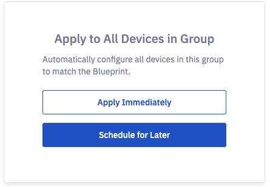

# How to Add a Blueprint?

Once you have created a group, you can add a Blueprint to it. Click ellipsis(...) and choose Add Blueprint from the menu.

  

Alternatively, you can add a blueprint by clicking the Add Blueprint link in the summary section of the group.

Step1: On the modal, you can create a new Blueprint, clone an existing one, or import a JSON.

A Blueprint is assigned a name by default, optionally you can provide your own name and description. 

<!-- By default, a Blueprint is unlocked. A locked Blueprint can be used to enforce the inheritance of settings across all subgroups. -->

  

Step 2: Here, you will be able to apply the different settings to the Blueprint. Click [here](./blueprint-settings.md) to learn more about the settings.

  

<!-- Note: You can also lock particular sections of the Blueprint settings. -->

 
Click **Save and Continue** when you have chosen the desired settings. You have the option to add the comments if you have modified the blueprint.

We recommend that you add comments to track the changed settings.

  

Step 3: You will be prompted with an option to apply the Blueprint immediately or schedule for a later window. This will automatically configure all devices in this group to match the Blueprint. Changes will apply to all subgroups as well.

You will be prompted with a pop-up to confirm your choice.

:::tip
If your group does not have a devices onboarded, click 'X' and the blueprint will be assiciated with the group. 
:::  

