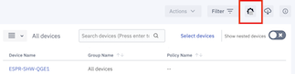
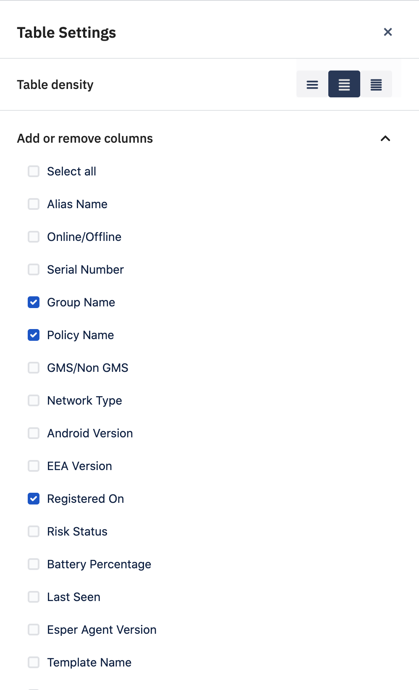

## How to Customize the List View Table?

List view of devices has more customization options available. To customize, click the ‘Table Settings’ icon shown in the diagram below. This icon is available on the “Devices & Groups’ screen.

  

  

You can control the table density to fit more or fewer items in the list view. Also, you could add or remove devices attribute columns to the list view.

:::tip
 You can now add IMEI atttibute to the list view table.
:::
