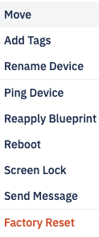
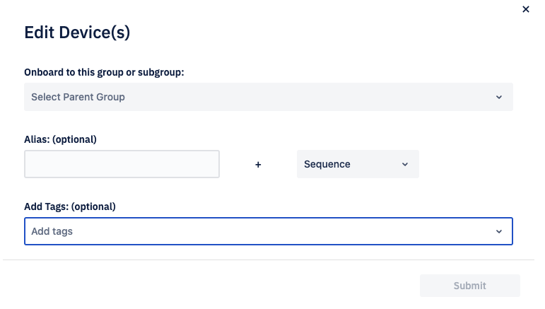
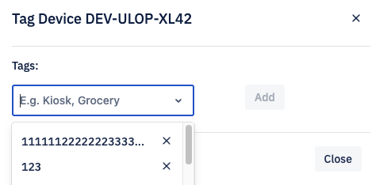
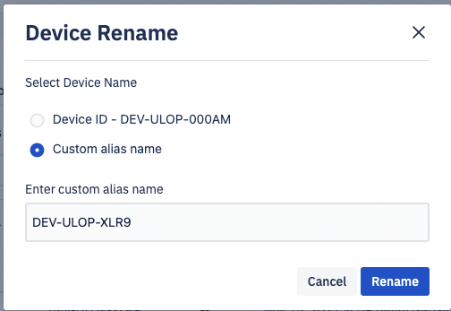
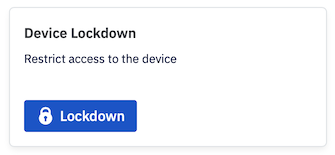
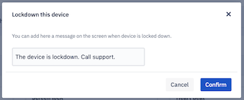
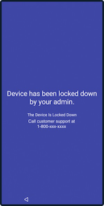
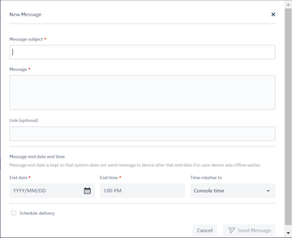
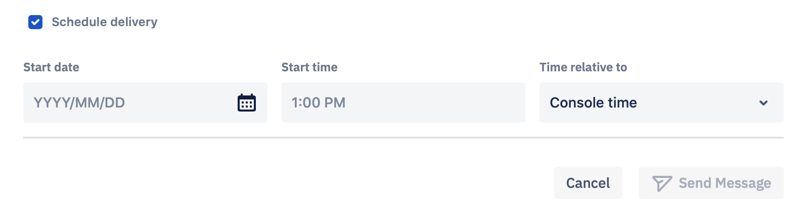
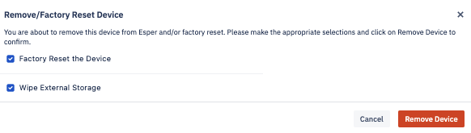

# What are the Actions Available for the Device?

On the device view, clicking on the ellipsis will open you a list of options to perform on the device.

## Move

You can move the device from the existing group to another. Select the Move option from the drop-down. On the pop-up, choose the target Group.

Add the optional alias, sequence, and tags and click ‘Submit’. When successful, the device will be moved to the target Parent Group.

## Add Tags

Tags make it easy to identify devices in a specific location, type, Wi-Fi, or SSID. You can add upto 5 tags. Select Add Tags from the dropdown. You can add a new tag or select from a list of already added tags.

Click ‘X’ to remove the existing tag. Deleting a tag will also remove it from all devices with that tag. We display a warning that the action will remove this tag from any tagged device. When a tag no longer exists on any device, it will be deleted from the dropdown.

## Rename Device

Choosing the ‘Rename Device’ option from the dropdown allows you to select the device ID or add a Custom Alias name for the device.

 

Click Rename to change the alias name.

:::tip

You cannot change the device Id. When you rename a device, you are adding an alias name.
:::

## Lockdown

The lockdown option from the menu triggers a complete lockdown of the device. This is useful to prevent unauthorized use or relocation.

When you click Lockdown, a custom message text box appears where you can enter the text you want the device user’s to see.

 

After the device has been locked down, the user will see the following screen.

After a device is locked, the button will change to Unlock to enable you to unlock the device from the Console.

## Ping Device

When you select the Ping Device, the Esper Console will attempt to ping the device. It is used when you want to check if your device is reachable or not.

## Reapply Blueprint

When you select Reapply Blueprint, this reapplies the device’s associated Blueprint. So all settings defined in the Blueprint will get pushed to the device.

  

## Reboot

When you click Reboot, the Esper Console will send the command to reboot a device. You can reboot your device if you are having trouble communicating with the device.

## Screen Lock

When you select Screen Lock, the Esper Console will send the command to lock the screen of the device. You can lock your device screen whenever you notice any suspicious activity.

  

## Send Message

Send message allows you to send a message to the selected device. Select the device you want to send a message to, click the ellipsis and choose “Send Message”.

Enter the subject and the body of the message. You can also include an optional link. You need to enter the end date and time for the message. For devices at a different location, you can reference the date and time from the device or the Console. The Console will not send the message after the specified end date and time.

The message is sent only to the online devices immediately. The system will attempt to send the message to offline devices till the specified end time.

When you select the ‘Schedule Delivery’ checkbox, you will be prompted to enter the start date and the time. You can choose the date and time to correspond with the Console time zone or the device time zone.

Click Send Message when you are ready to send the message. Clicking Cancel will take you back to the Unmanaged Group screen.

## Factory Reset Device

Users will have an option to remove devices from the Esper Dashboard. There is a checkbox for ‘Delete approval of directory record’ and for ‘Wipe external device.’ If you do not select either option, the Console will factory reset your device.

If you select the ‘Wipe external device’ option, the device will be wiped and removed immediately from the dashboard if it’s online. For offline devices, our system will wait for it to come online for the next 24 hours and if it does, the Console will wipe and remove the device. If it doesn't come online in 24 hours, then the device will be removed from the Console only between 24 to 36 hours.

If the device user executes a factory reset directly on the device, the device will still appear in your Esper Endpoint as an offline device. If you re-provision the same device on your Esper Endpoint, it will keep the same Device ID, but you will need to re-enter the custom alias and any tags you previously added for the device.

If you select the ‘Delete approval of directory record’ option, the directory record is deleted.

