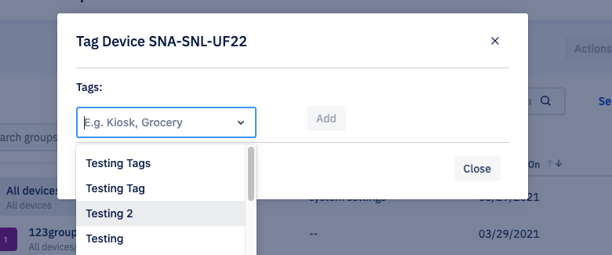
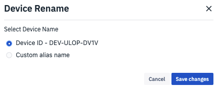

# What Are the Possible Actions on a Device?

On the ‘Device and Groups’ screen, click the ellipsis to access more actions for each device.

  

  

Following are the possible actions:

  

### View on Map

Choose the ‘View on Map’ option from the drop-down menu. This will display the location of the device on the Google map. Here you will be able to access different map features offered by Google.

  

  
:::
Map will be opened in a new window.
:::
  

### Add Tags

Choose the ‘Add Tags’ option to add tags. Tags help you identify the device.

  

Click **ADD** button to  add a tag. Clicking **Close** will take you back to the ‘Device and Group’ landing page.

 :::tip
Using the drop-down you can also choose from the perviously added tags.
:::
 

### Rename Device

Choose the ‘Rename Device’ option to rename a device. This helps you rename the device. On a pop-up, you select a device name or create a custom name.

  

  

Click **Save Changes** to rename the device. Click **Cancel** to go back to the ‘Device and Group landing page.

  

### Change Device Icon

In the grid view, there is an additional action to change the device icon. To access this, switch to the grid view. If you need help, please refer [here](./switch-view.md) for steps to switch to grid view. Now click on the ellipsis and choose the ‘ Change Device Icon’ option from the drop-down.

  

  

On the pop-up, you will see the list of icons available. Esper allows you to set the icon for all the devices with the same model or to a particular device.

  
:::
This option is available only in the Grid View.
:::
  

  
Click **Change** to apply the selected icon. Clicking **Cancel** will take you back to the ‘Device and Group landing page. Clicking **Remove Icon** will remove the applied icon.