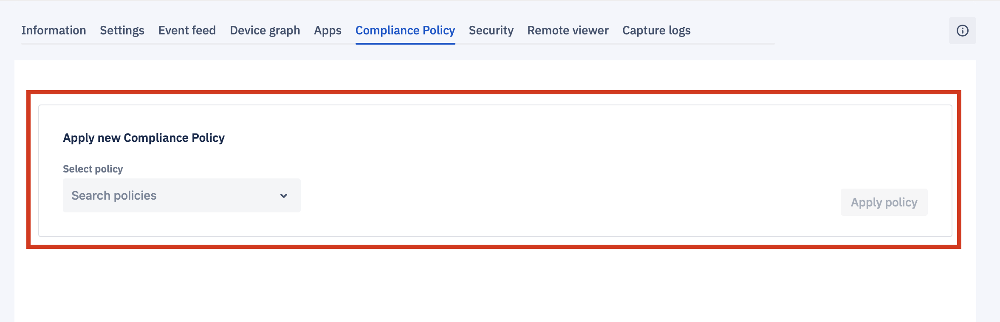
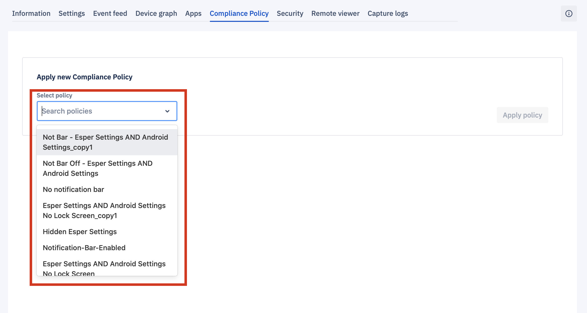
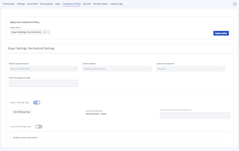
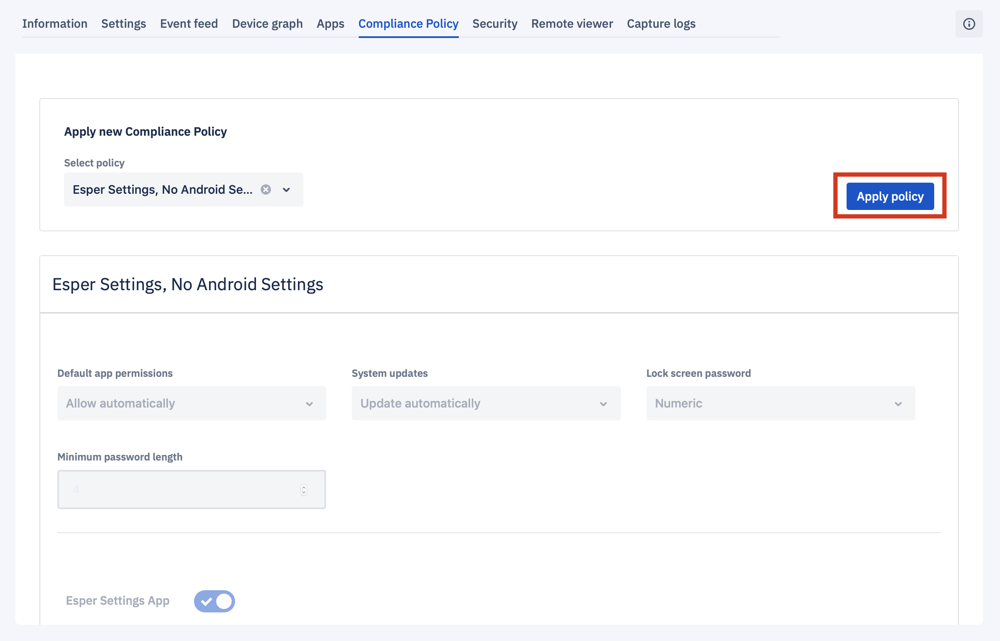
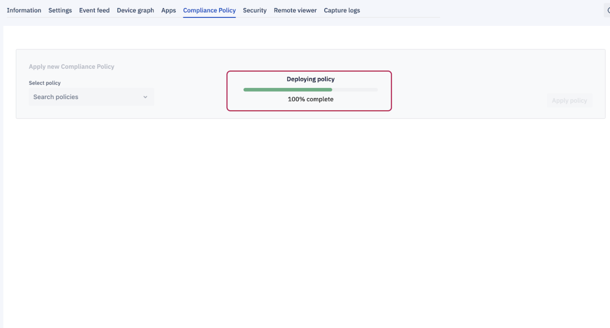

## How to Manage Compliance Policy on a Single Device?

You can change the Compliance Policy applied to a device via view details for the device.

  

**Note**: Compliance policy changes can only be applied to the online device.

  

To install a new **Compliance Policy** on the device, first, select the policy from the dropdown menu. You need to first create a Compliance Policy to have it available in the dropdown.

  

  

You’ll find more information on compliance policies in the  [Compliance Policy section](../compliance-policy/README.md).

  

### H3 Apply a New Compliance Policy on a Single Device

  

Step 1: On the compliance tab, you will have an option to select and apply a new compliance policy.

  

  

Step 2: Choose the policies you wish to apply from the drop-down.

  

  

Step 3: Preview the policy for correctness.

  

  
  

Step 4. Once verified, click on **Apply Policy** button.

  

  
  
  
  

Step 5: A success message will be displayed after the new compliance policy is deployed on the device.

  

  
  

**Note**: In order to create a new policy, you need to navigate to the static menu on the Dashboard and choose Compliance Policy from the menu.  Click here to learn how to create a new policy