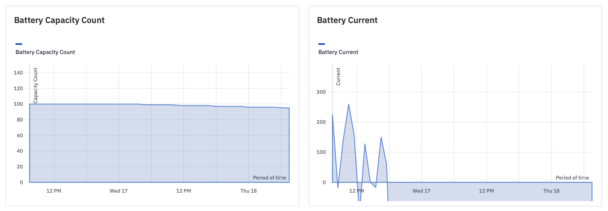
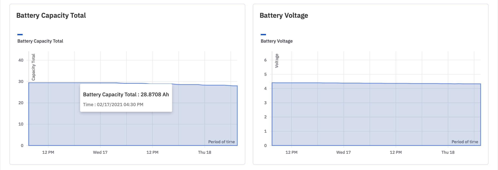
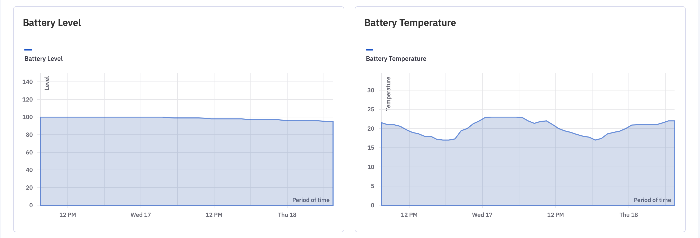
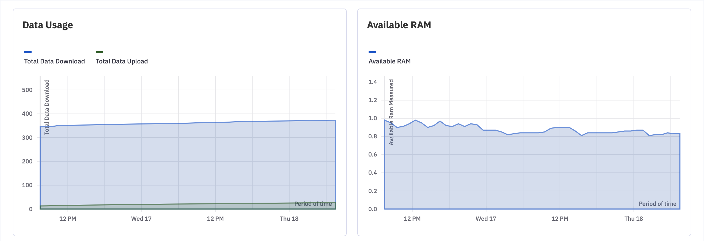
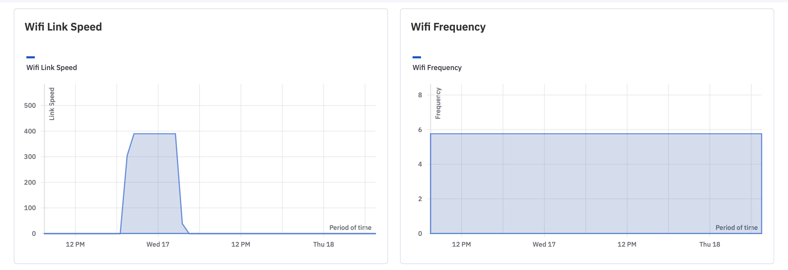
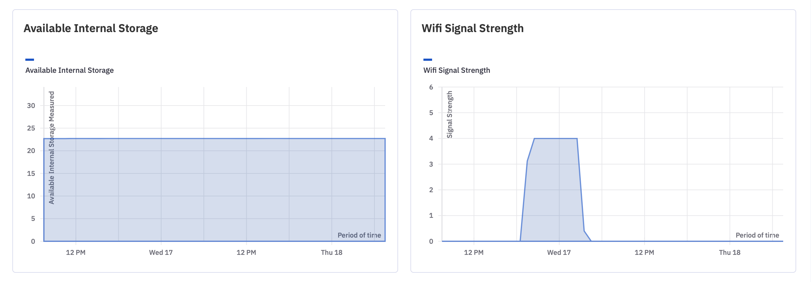
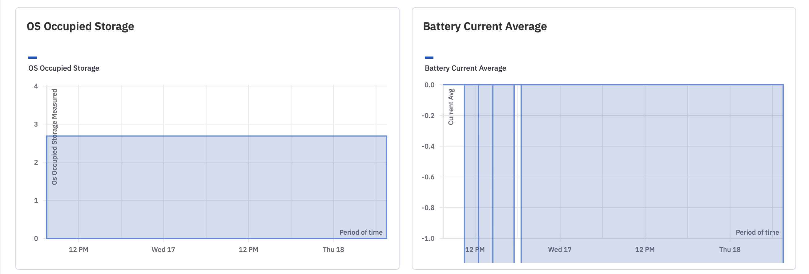

# How to View the Graphs of a Single Device?

  

This section provides a graphic representation of various telemetry for a specific device over the last 7 days. Click on the device and open the Device graphs section.

  

  

The following metrics are displayed:

-   Battery Capacity Total
-   Battery Capacity Count
-   Battery Current Average
-   Battery Level
-   Battery Voltage
-   Battery Temperature
-   Available RAM
-   Available Internal Storage
-   Battery Current
-   Data Usage
-   Wi-Fi Signal Strength
-   OS Occupied Storage
-   Wi-Fi Frequency
-   Wi-Fi Link Speed
    

  
  

  
  

  

  

  

  

  
  

  

If a device stays inactive for more than seven days, you will see an alert stating the same.

  

  

However, you can get 100+ data points to monitor via our Grafana API interfaces to your existing system and can integrate it faster. For more details contact Esper support at ([support@esper.io](mailto:support@esper.io)).

  

