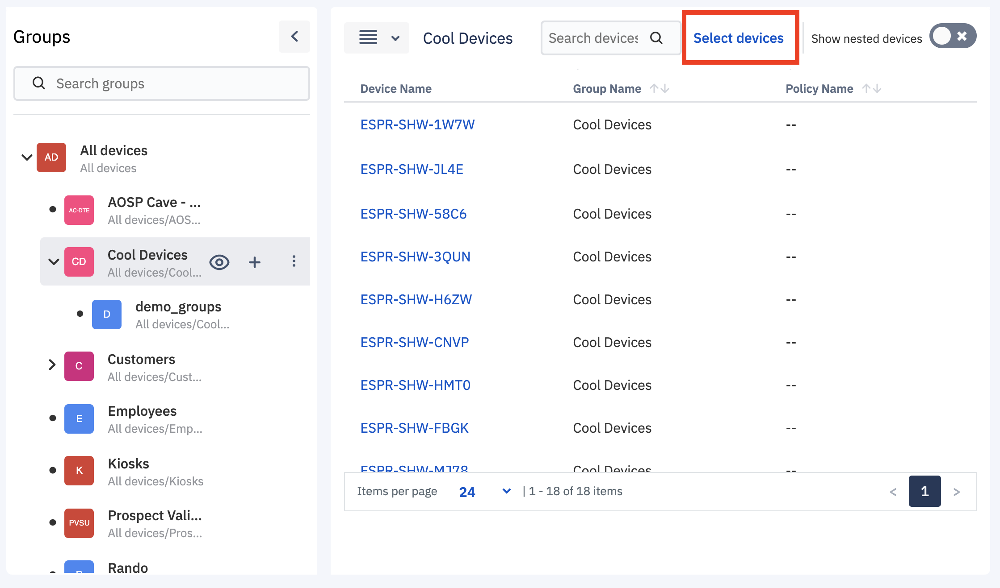
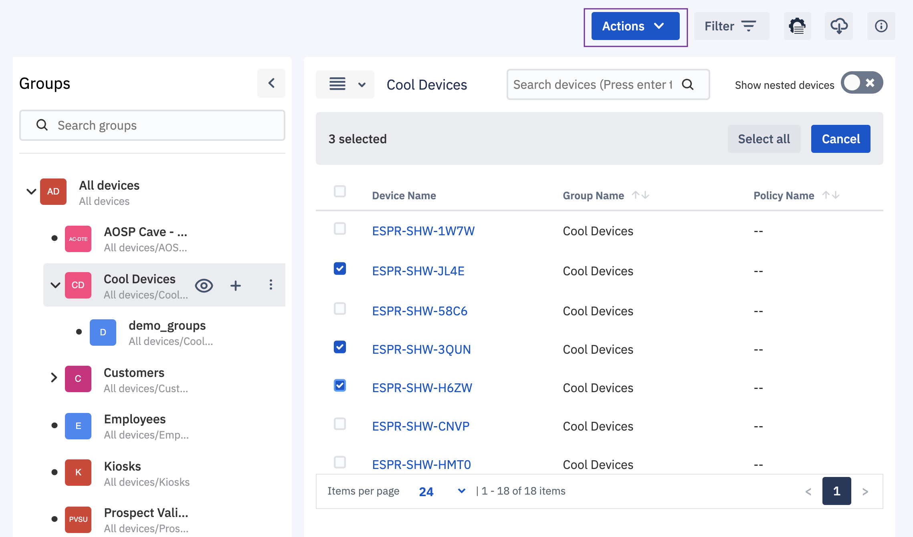
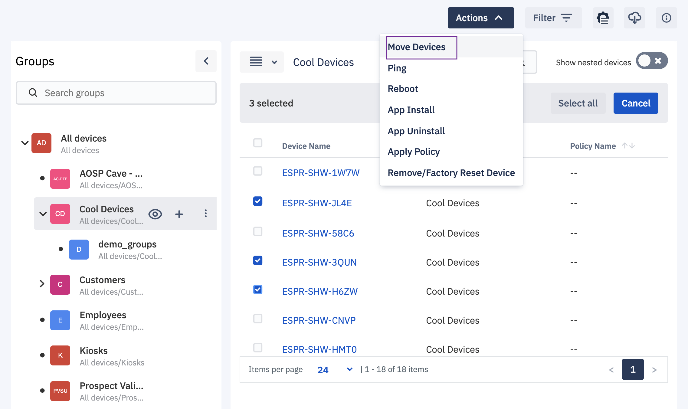
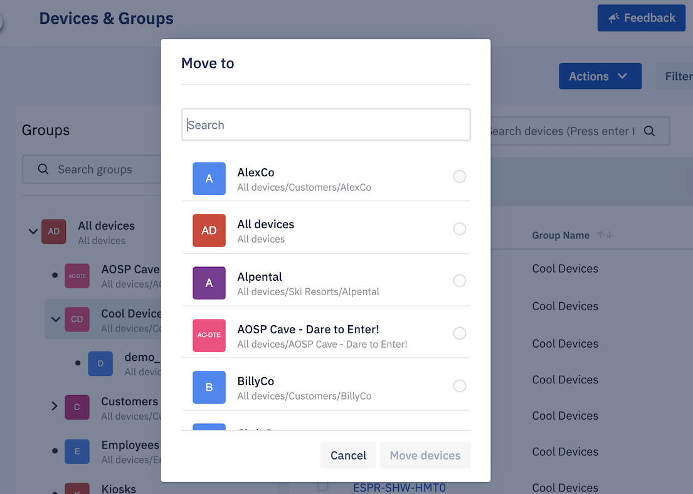

## How to Move the Devices to Another Device Group?

Esper provides a way to directly move devices to some different device group. You can choose the devices you wish to move and then select the destination device group.

Check step by step instructions below:

  

Step 1: Click on the Select devices link on the top right corner to expose the selection checkbox on the devices.

  

  

Step 2: Click in the checkbox next to the devices you wish to move.

  

  

Step 3: Selecting devices will highlight the Actions button on top. Choose the ‘Move devices’ option from the dropdown menu.

  

  

Step 4: Select the destination device group where you want to move the selected devices.

  

  

Your devices will be moved successfully and a success toast message will be displayed.

  

**Note**: Moving and selecting the devices is now also available in the grid view.