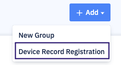
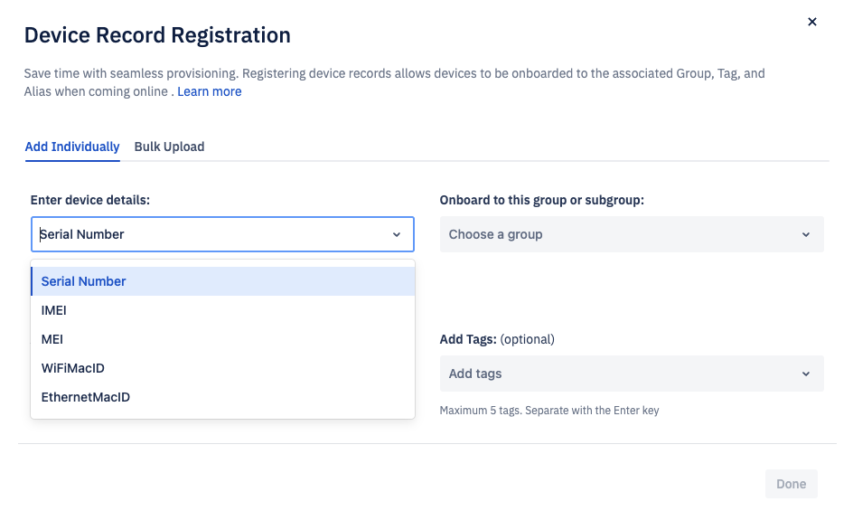
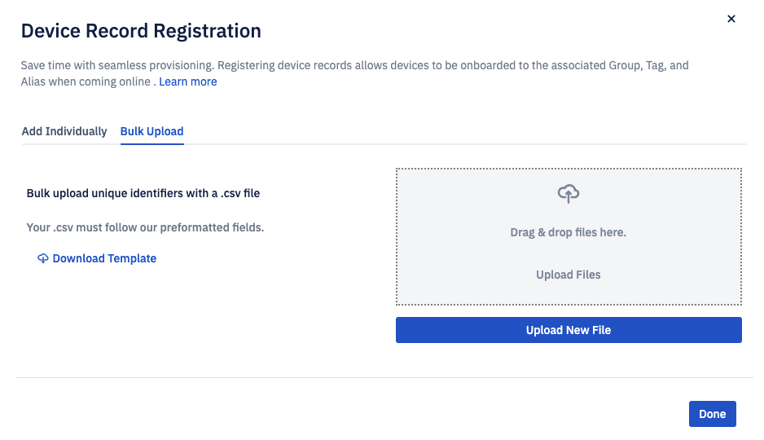

# How to Create a Device Record?
Navigate to the Devices & Groups section of the Console. Click Add and choose ‘Device Record Registration’ from the options.

## Individual Devices
Choose Individual Devices from the options to create a record of a single device. On the modal, enter the unique identifier for the device you wish to upload. 

You have an option to upload a device to the directory or choose a group/subgroup for the device. This device is managed using a Blueprint. If you choose to upload the device to the directory, it will be a part of the unmanaged devices group and the device need to be moved into a group to manage it using a blueprint. 
Once you select the group/sub-group to onboard the device, enter the optional alias and tags. Click the Review & Add button.

:::tip
You can scan a QR code for a group and onboard the device to it. The device will be added to the selected group with the associated blueprint.
:::

## Bulk Upload
This allows you to upload multiple devices at once. You can download a [template](/onboardingdocs_sample_CSV.csv), fill in the details, and upload the .csv file. Click Done. 

When is device is uploaded a record gets created. A record is a Unique Identifier (IMEI, Serial Number, Mac Address) that is associated with a device. Following are the ways a record can be created: 
- Automatic Creation - A Record is created when using an Onboarding Method.
- Manual Creation - A Record is created by uploading a unique identifier to the Directory.
A record can be assigned a group, tag, and alias

