## How to Manage and Control the Settings for a Single Device

  

All the settings which you manage in provisioning templates during provisioning time can be separately managed and controlled for each device at any time. Settings are the second tab on the device details screen.

  

  

**Note**: You can access the device details when you click on the name of the device on the ‘Device and Group’ screen.

  

The Settings section lets you determine levels for most of the device settings. These include screen brightness, wallpaper, alarm volume, and screen timeout. You can also set up devices with Wi-Fi credentials, along with determining the duration of an ADB session if ADB was enabled in the [Compliance Policy] section.

  

**Note**: If the Android Settings App is enabled for a device in Multi-application mode, the device user can access these settings and change them on the device.

  
  

Settings are categorized into the following:

  

### Quick Actions

  

Quick actions allow the user to perform some troubleshooting commands and some quick modes.

  

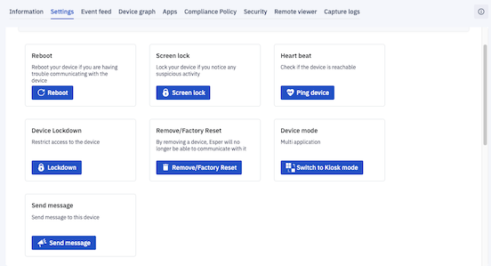

  

#### Reboot

  

When you click Reboot, the Esper Console will send the command to reboot a device. You can reboot your device if you are having trouble communicating with the device.

  

  

#### Screen Lock

  

When you click Screen lock, the Esper Console will send the command to lock the screen of the device. You can lock your device screen whenever you notice any suspicious activity.

  

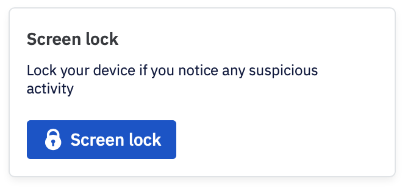

  

#### Heartbeat

  

When you click the Ping device, the Esper Console will attempt to ping the device. It is used when you want to check if your device is reachable or not.

  

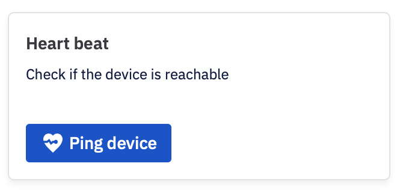

  

#### Device Lockdown

  

Clicking the Lockdown button triggers a complete lockdown of the device. This is useful to prevent unauthorized use or relocation.

  

  

When you click Lockdown, a custom message text box appears where you can enter the text you want the device user to see.

  

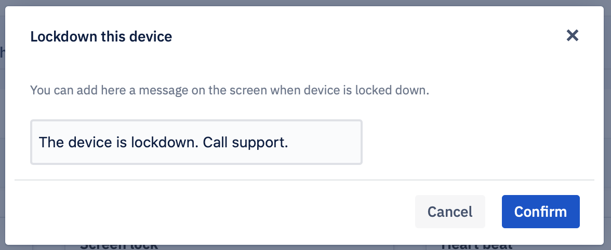

  

In this example, after the device has been locked down, the user will see the following screen.

  

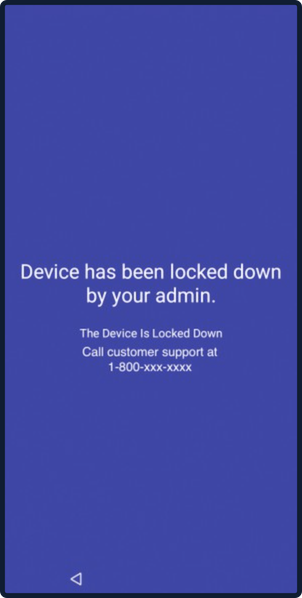

After a device is locked, the button will change to Unlock to enable you to unlock the device from the Console.

  

#### Remove / Factory Reset Device

**Note**: The Wipe Device Command has been renamed to “Remove/Factory Reset,” providing additional capability.

Users will have an option to remove devices from the Esper Dashboard. This is applicable to one or more devices or groups. There is a checkbox for ‘Factory Reset the Devices’ and for ‘Wipe External Storage.’

**Note**: By default, this option will be checked. For online devices, factory reset will be enabled.

  
  
  

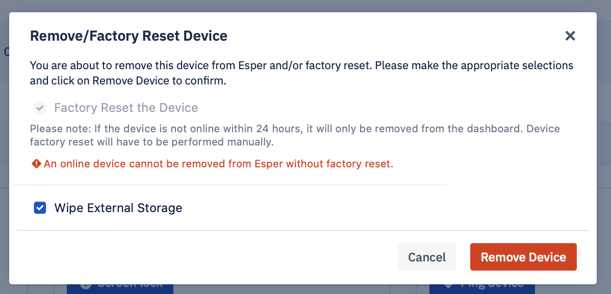

  

**Note**: If the device user executes a factory reset directly on the device, the device will still appear in your Esper Endpoint as an offline device. If you re-provision the same device on your Esper Endpoint, it will keep the same Device ID, but you will need to re-enter the custom alias and any tags you previously added for the device.

  

#### Device Mode

  

The Device mode function enables you to switch a device between multi-app mode and kiosk mode. When a device is in Multi-Application mode, the user can see and use all the approved apps. When a device is in Kiosk mode, the device acts as a kiosk, and users can only use the kiosk app. Oftentimes, users’ provision with additional apps is useful for setup and diagnostics at customer sites. Device mode makes it easy to switch out of Kiosk mode to make those apps available for use by a field technician or customer, and then switch back into Kiosk mode when done.

  

To change a device to Kiosk mode, click **Switch to Kiosk Mode**. A panel will slide in from the right side; click the radio button for the mode you prefer. If you click the Kiosk Mode radio button, you will also need to choose the application that will be pinned to the device’s start screen as its primary app. Select it from the searchable 'Select Kiosk App' dropdown, and then click **Save**.

  

  

**Note**: In some situations, a device provisioned in Kiosk mode will be unable to connect to the Internet—if, for example, a Wi-Fi access point has changed credentials. In these cases, the Esper Dock can be used to open the Esper Settings app giving access to Wi-Fi settings locally on the device.

  

#### Send Message

Send message allows you to send a message to the selected device. You can access this feature from the ‘Device and Group’ screen. Select the device you want to send a message to and navigate to the ‘Settings’ tab. Under the Quick Actions, you will find the Send Message option.

  

Step 1: Click on the **Send Message** button.

  

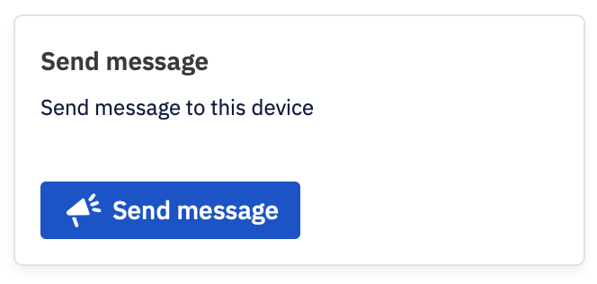

  

Step 2: Enter the subject and the body of the message. You can also include a link. You will be asked to enter the end date and time for the message. The date and time can be taken from the device or the console. This is useful when the device is at a different location. The message will not be sent after the specified date and time.

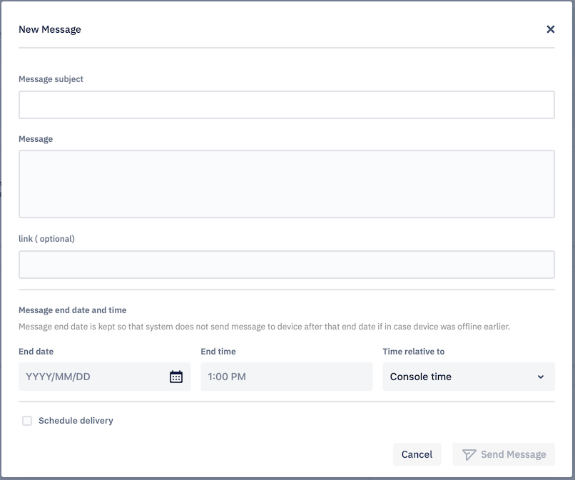

  

**Note**: The message is sent only to the online devices. It will try to send the message to offline devices till the selected date and time.

  

When you select the ‘Schedule Delivery’ checkbox, you will be prompted to enter the start date and the time. You can choose the date and time to correspond with the console time zone or the device time zone.

  

Step 3: Click Send Message when you are ready to send the message. Clicking Cancel will take you back to the settings screen.

  

### Display settings

  

This section lets you adjust the display settings of the device.

  

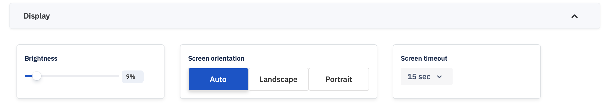

  

####  Brightness:

Use the Brightness slider to Increase or decrease the brightness of the screen.

  

#### Screen orientation:

Select screen orientation from the three options: Auto, Landscape, or Portrait. Some device makers swap the settings for Landscape and Portrait. If your device was provisioned with a specific orientation but is locked into the other orientation, try swapping this setting to achieve the proper screen orientation setting.

  

####  Screen timeout:

Select screen timeout duration—the time after which the device screen will turn off if left idle—ranging from 15 seconds to Never (meaning the screen will always be on, important for Kiosk mode deployments.

  

A toast message will appear in the bottom right section of the screen indicating success or failure for each change applied to the device.

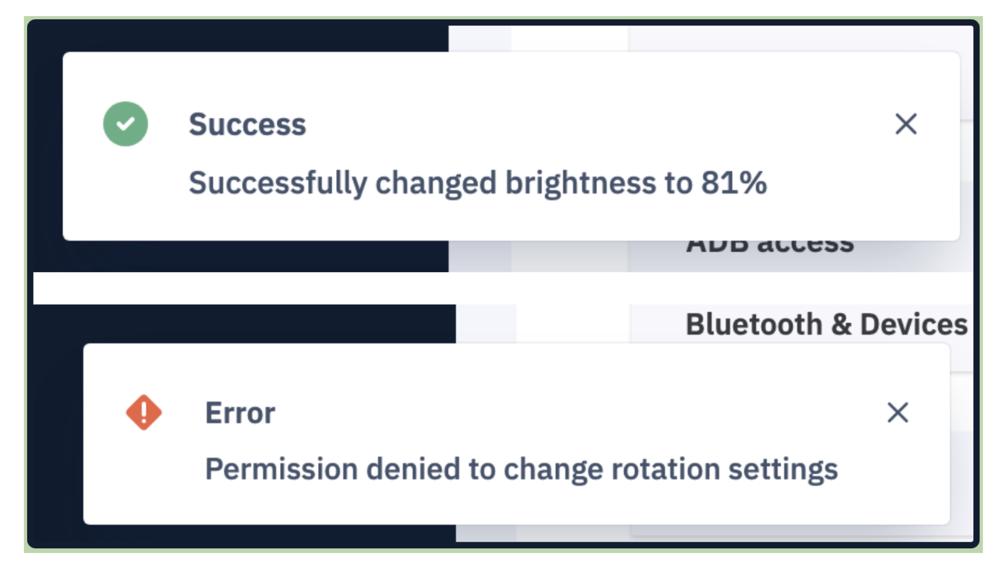

  
  
  

###  Branding settings

  

You can add branding to the device by setting both Portrait and Landscape mode wallpaper, as well as Lock Screen wallpaper. The supported image formats are JPEG, PNG, or JPG with a 25MB size limit. Be sure to crop the image to match the screen resolution of the devices you plan to provision with this template, otherwise they will be stretched to fit. You can preview and adjust each image after you upload them.

  
  

  
  

### Sound settings

  

This section lets you adjust the sound settings of the devices in the group. Use the sliders to adjust the Alarm volume, the Notification volume, the Music volume, and the Ring volume.

  

  
  

###  WiFi Settings

This section lets you adjust the WiFi settings for the device.

#### WiFi

It enables you to turn Wi-Fi connectivity on or off for the selected device.

  

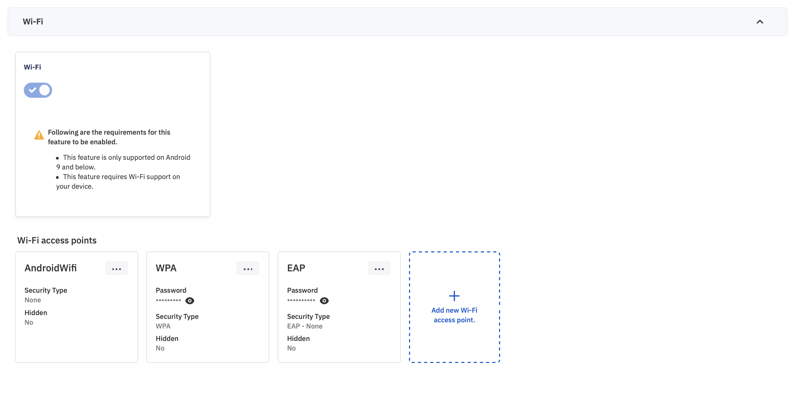

  

**Note**: If you switch off Wi-Fi when no other connection is available, Esper will turn Wi-Fi back on after 10 seconds if no other internet connection is available so Esper can maintain communication with the cloud backend.

#### Wi-Fi access points

  

You can preload preferred Wi-Fi networks to which the provisioned device will automatically connect as they become available. The device will automatically connect to the given Wi-Fi access points as per the availability and network strength after provisioning.

**Note**: The Wi-Fi on/off and WiFi access points features are not available for devices running Android 10.0 and above.

  

When you are adding a new access point, this section has four fields to configure: Wi-Fi SSID, Wi-Fi Password, Wi-Fi Security type, Hidden. The Wi-Fi SSID and Wi-Fi Password fields are text fields into which you enter the SSID and password for the access point. Select the security type from the dropdown menu. There are four possible choices:

-   NONE
    
-   WPA- Wireless Protected Access
    
-   WEP- Wired Equivalent Privacy
    
-   EAP- Extensible Authentication Protocol
    

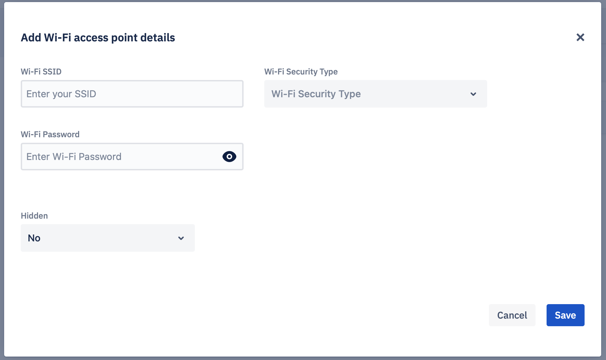

If you select EAP, you will be prompted to enter additional information.

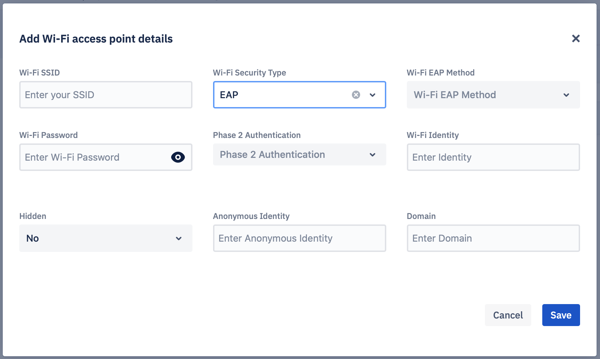

Wi-Fi EAP Method is a drop-down with the following options:

-   PEAP-
    
-   TLS-
    
-   TTLS-
    
-   PWD-
    

Similarly, the Phase 2 Authentication is also a dropdown with the following options:

-   NONE
    
-   PAP
    
-   MSCHAP
    
-   MSCHAPV2
    
-   GTC
    
-   SIM
    
-   AKA
    
-   AKA_PRIME
    

###  Location settings

  

This section lets you adjust the use of the Global Positioning System (GPS) by the device.

  

There are four GPS accuracy settings:

-   High Accuracy — Optimizes for accuracy using extra inferences and heuristics for quicker location resolution.
    
-   Device Only — Uses just the GPS chipset of the device and not any extra inferences or heuristics. This can slow location resolution.
    
-   Battery Saver — Optimizes for longer battery life at the cost of location accuracy.
    
-   Off — Turns off device GPS.
    

Once a change is made, a toast message will appear in the bottom right corner of the screen indicating success or error for changing the GPS settings.

### Bluetooth & devices settings

  

This feature allows you to control any Bluetooth connections to the device. Turning OFF the toggle button turns the device’s Bluetooth off.

When you turn the toggle button ON, the information under “Paired Devices” will show all the Bluetooth devices paired and their connection status. Until the device user removes the device by choosing to “Forget Device” from the list of paired Bluetooth devices, the device will be visible in the Paired Devices list.

  

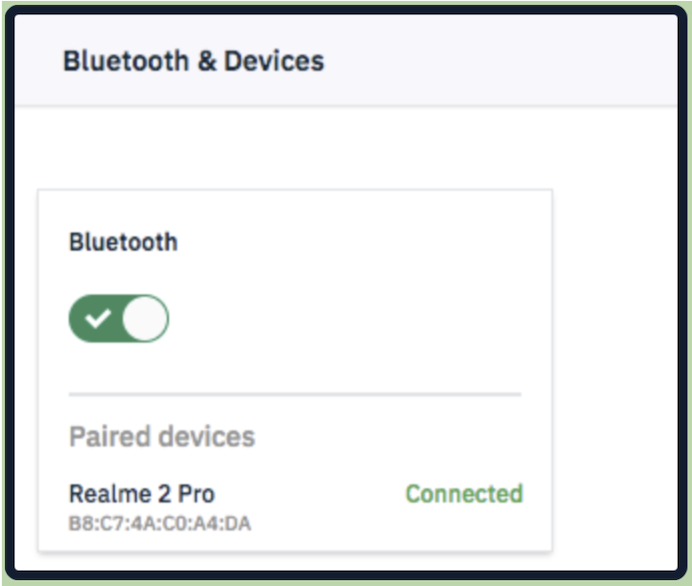

Once a change is made, a toast message will appear in the bottom right corner of the screen indicating success or error for turning Bluetooth on or off.

###  Time & date settings

  

Select the time zone in which the device will be deployed. After deployment, you will have the ability to change the device’s time zone remotely via the dashboard.

  

**Note**: If you don’t specify a device time zone, the time zone set by the device will be used.

The Time Zone field has a robust search capability. As you begin to type, suggestions will be displayed. For example, typing "Pacific" will bring up all the time zones that start with "Pacific." Listings are by country, for example, to find the timezones for the U.S.A., search for "America" or "US".

  
  

  
  

### Android Debug Bridge (ADB)

  

Android Debug Bridge (ADB) is a command-line tool that enables administrators to use a Unix shell to communicate with an android device. If ADB was checked in the Compliance Policy section, you can turn on ADB here for a configurable time period. If ADB wasn’t checked in the Compliance Policy section, ADB can not be turned ON.

  

On a managed device, you can turn on ADB using the toggle switch to enable a secure remote ADB session using Esper. When you turn on ADB, you must set the duration of the ADB session:

-   Always On
    
-   1 hour
    
-   3 hours
    
-   8 hours
    
-   1 day
    

After the completion of this time period from the point of provisioning, ADB will automatically turn off for the device.

You can choose the Always On option to keep ADB on, but Esper does not recommend this practice; as ADB is a gateway to communication with the core of the device and should be used in a highly secure manner. You can find out more about using ADB with Esper [here](https://docs.esper.io/home/console.html#connecting-to-a-device-using-secure-remote-adb).

**Note**: We never allow turning on ADB from the device on any Esper-provisioned device.

Once all changes are made, click Apply Changes link to push them out to the device, or Cancel if you wish to keep the current settings.

  

  

After applying any changes, individual toast messages will appear in the bottom left corner of the screen indicating success or error for each change made.