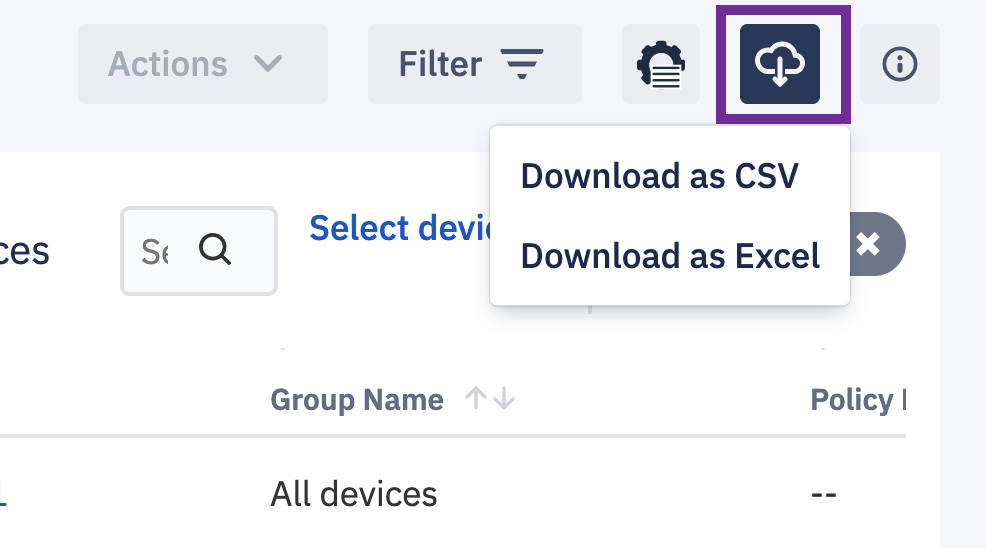

## How to Download the CSV List of Devices?

:::tip
The download CSV option is only available in the List: Device view. 
:::

Click the view icon and select the List:Device view.  Clicking the cloud icon  to download the device data for your current set of devices to a CSV or Excel spreadsheet.

  

  

:::tip
Currently, this feature is only supported for up to 500 devices. Please adjust your filter appropriately to keep the list below 500 devices.
:::