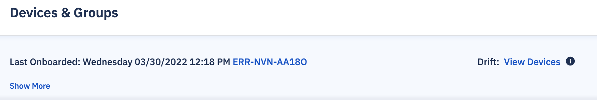
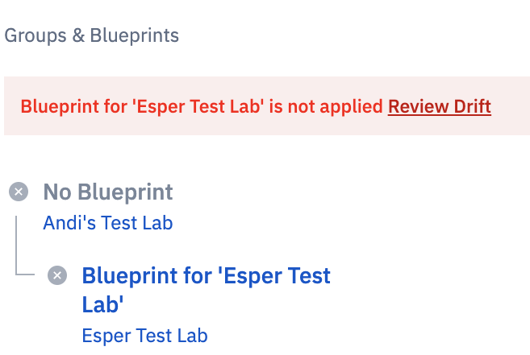
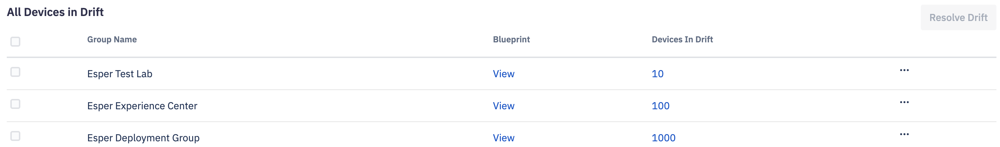
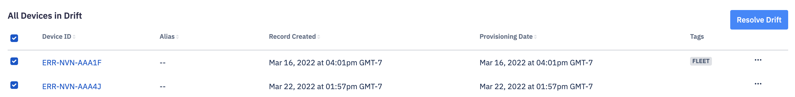
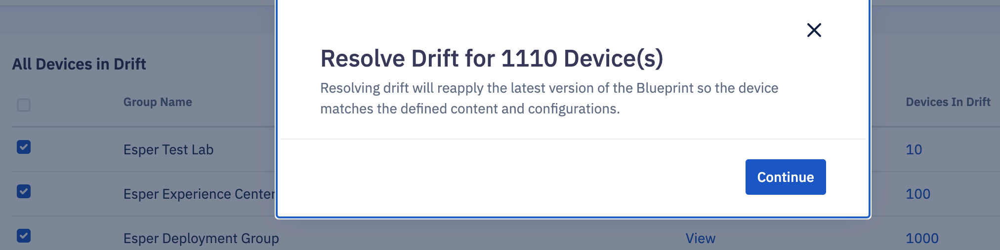
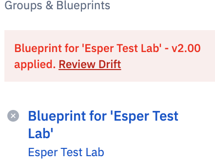
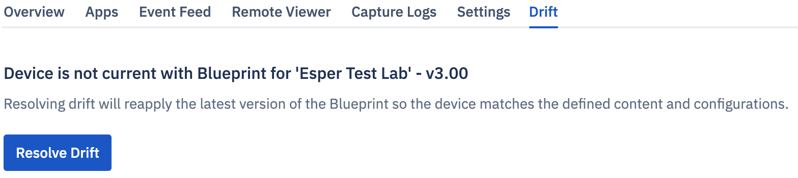

# What is Drift?

A device goes in a drift when the Blueprint applied to the device does not match the Blueprint applied to the group.

You will see a drift notification in the summary section at the group level.

  

Navigate to the device view at the device level to see the error message.

Devices will go in drift in the following two situations:

  

1.  You just created a group— not applied a Blueprint yet. You onboarded a device(s) to this group. It's provisioned to the Esper platform using the default settings. You now apply a Blueprint to the group.
    
2.  You have created a group, added a Blueprint, and onboarded a device(s). The device(s) goes offline. You make some changes to the Blueprint settings and reapply the Blueprint to the group.
    

## Resolve the drift

You can resolve drift at the group level or the device level.

  

Navigate to the ‘Devices and Group’ section of the Console. Click the Drift: View Devices notification for the group.

Click devices in the drift column corresponding to the group your device belongs to on the drift screen. This will resolve the drift for each device.

Here, you can also select the entire group and resolve drift for all devices at once.

  
  

  

Once you select the device(s) or group, click resolve drift.

  

  
  

On the pop-up, click continue to resolve the drift.

  

  

You can also resolve the drift from the device view. Click Review Drift.

  
  

You will navigate to the drift tab. This tab is only present when there is a drift.

Click Resolve drift.
