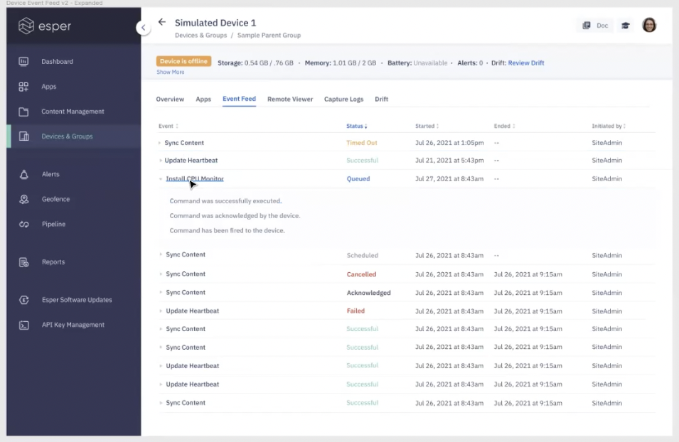

# What is the Event Feed?

The Event Feed tab lists all the interactions the device has had with the Console. It displays each command taken on the device, the status, and the name of the person that initiated the command with a date and time stamp. 

You can expand any command to view the breakdown of the command lifecycle. You can access this event field on the device detail screen under the ’Event feed’ tab.

:::tip
The event feed for the grop displays all the interactions for the devices in that group.
:::
