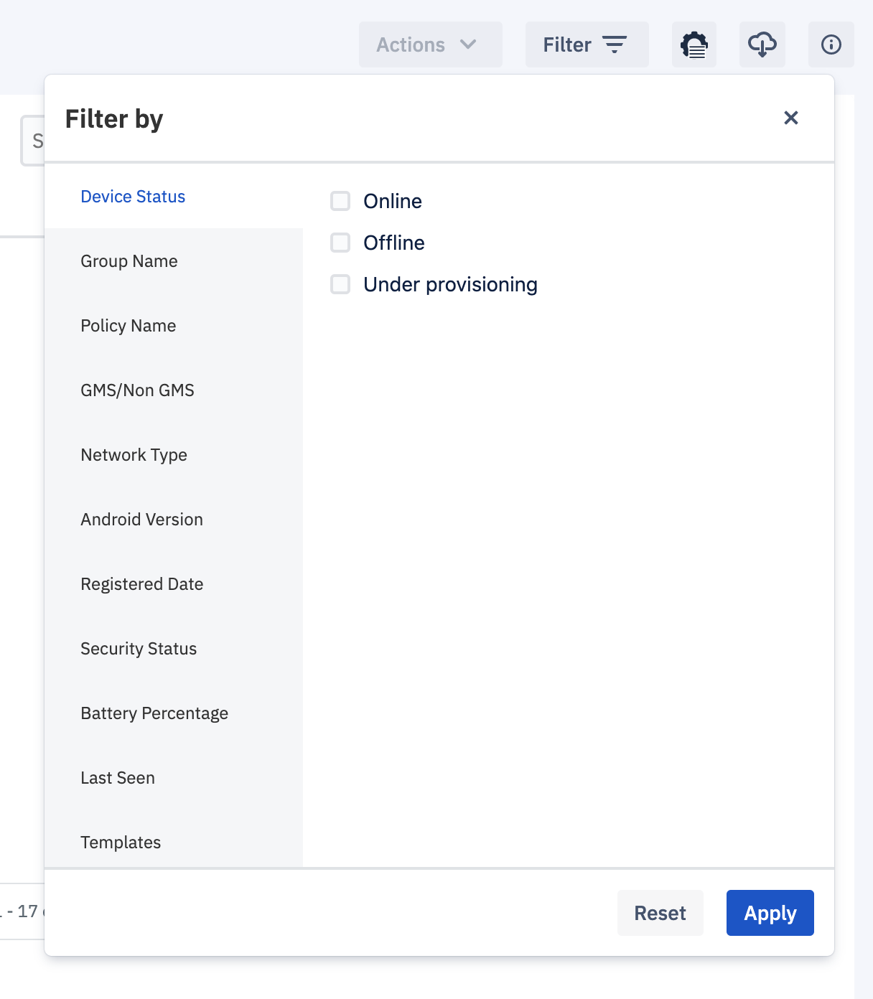

## How to Apply Filters to View Selected Devices?

The filters on the ‘Device and Groups’ section allows you to search devices faster. Currently, there are 11 types of filters available to make your search experience better. For example, you can choose Group A, Policy B, and Online and Offline devices. This will give you a filtered list of devices in Group A which are Online and Offline and have policy B applied to them.

  

Once you select the filter parameters, click **Apply** to update the view. Custom filters are stored locally via browser caching. Your selected preferences will be applied automatically when you return to this page unless you update your preferences or clear your cache. You can return to the unfiltered view by clicking **Reset**.

  

  

**Note**: The blue dot in the upper right corner on the filter button indicates a filter has been applied.