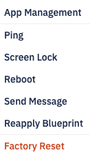
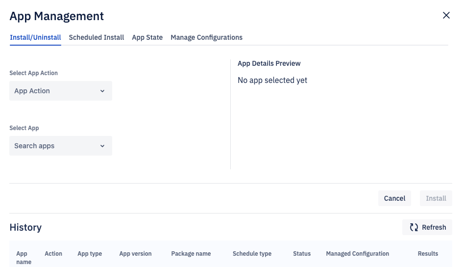
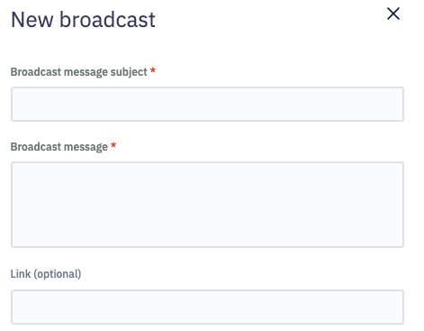
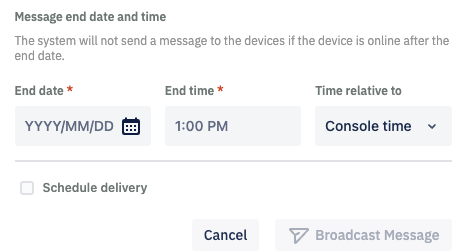

# What are the Actions Performed on the Group?

  

On the Group’s page, click the Action button.

## App management
Here you can manage the application install,un-install, app state and apply manage configurations to all the application in the group. This action is simialr to the device app section. You can find more info [here](./device-app-install-uninstall.md).  

## Ping

Esper-managed devices continuously communicate with our Cloud and update their statuses every minute. Esper Cloud will regularly wake the device if a device dozes off due to inactivity or a bad network connection. Click the Ping option to accomplish the same task manually.

You can queue the offline devices request for 24 hours after which the queued ping command will timeout.

  

## Screen Lock

When you select Screen Lock, the Esper Console will send the command to lock the screen of all the devices in the group. You can lock your device screen whenever you notice any suspicious activity.

## Reboot

The Esper Console will send the command to reboot a device when you click Reboot. You can reboot your device if you are having trouble communicating with the device.

## Send Message

Send message allows you to send a message to the devices in the group.

Enter the subject and body of the message, and include an optional link. Enter the end date and time for the message. You can reference the date and time from the device or the Console for devices at a different location. The Console will not send the message after the specified date and time.

The message is sent only to the online devices immediately. The system will attempt to send the message to offline devices till the specified end time.

When you select the ‘Schedule Delivery’ checkbox, you will be prompted to enter the start date and the time to correspond with the Console time zone or the device time zone.

Click Send Message when you are ready to send the message. Click Cancel to go back to the Group screen.

## Factory Reset Device

Users will have an option to remove devices from the Esper Dashboard. There is a checkbox for ‘Delete approval of directory record’ and for ‘Wipe external device.’ If you do not select either option, the Console will factory reset your device.

If you select the ‘Wipe external device’ option, the device will be wiped and removed immediately from the dashboard if it’s online. For offline devices, our system will wait for it to come online for the next 24 hours and if it does, the Console will wipe and remove the device. If it doesn't come online in 24 hours, then the device will be removed from the Console only between 24 to 36 hours.

If the device user executes a factory reset directly on the device, the device will still appear in your Esper Endpoint as an offline device. If you re-provision the same device on your Esper Endpoint, it will keep the same Device ID, but you will need to re-enter the custom alias and any tags you previously added for the device.

If you select the ‘Delete approval of directory record’ option, the directory record is deleted.

