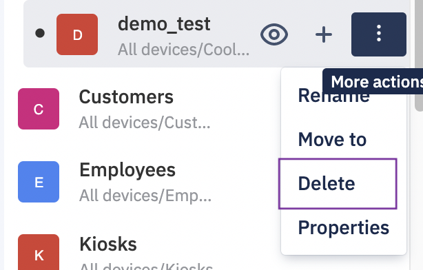
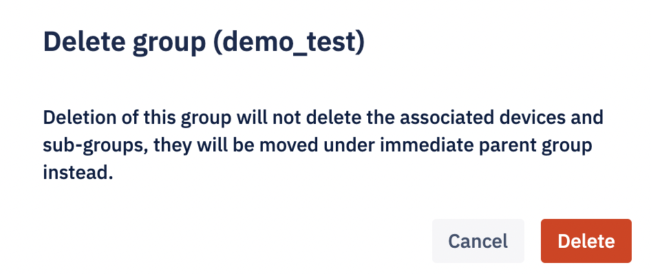

## How to Delete a Device Group?

You are allowed to delete any group except the “All devices” group which is a system group. When you delete a device group, it will not delete the devices or subgroups inside the group. But actually, it just deletes that group, and all the subgroups and devices will be moved under the immediate parent of the deleted group. If you haven’t created any parent for that group, then it will move under the system parent group “All devices”.

  

Step 1: Identify the group you wish to delete from the left pane of the ‘Devices and Groups’ screen.

  
  

Step 2: On hover, click on the ellipsis icon to see more actions.

  

  
  

Step 3: Click the **Delete** option. You will get a message to confirm the delete action to avoid delete by mistake.

  

  

Step 4: On confirmation of the message, your group will be deleted and you will receive a success toast message.

  

