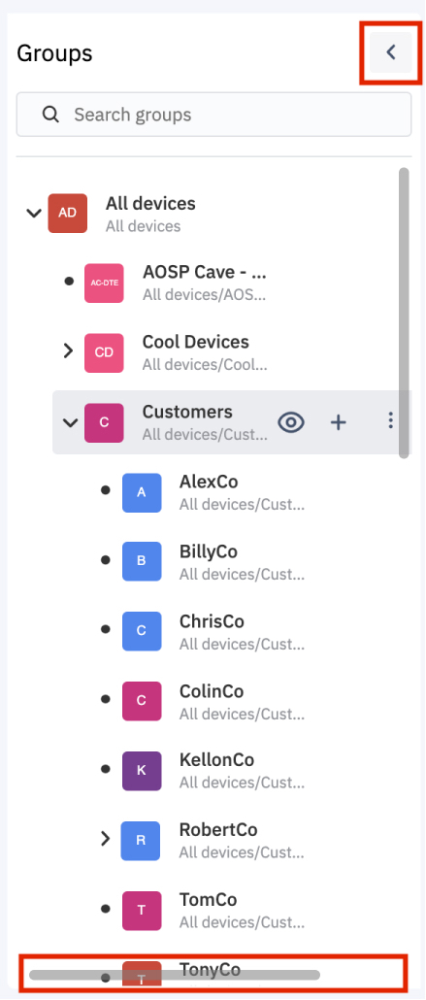
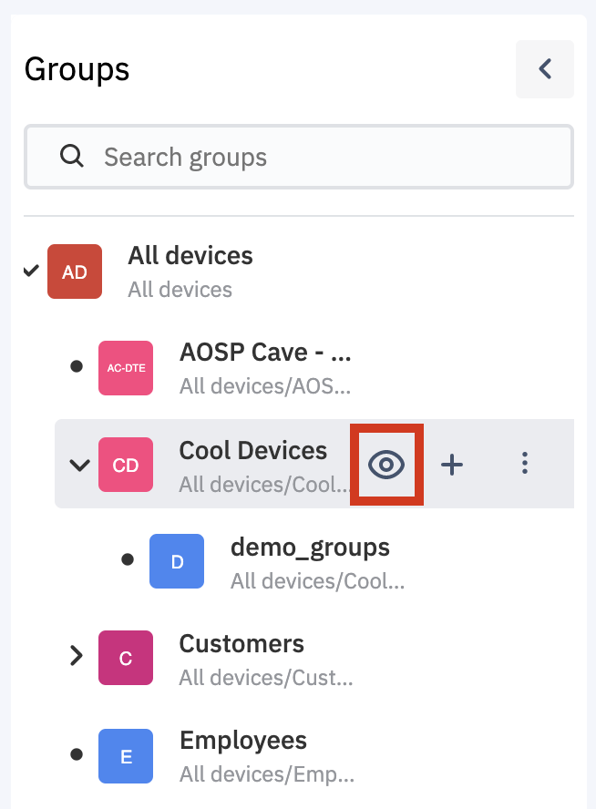
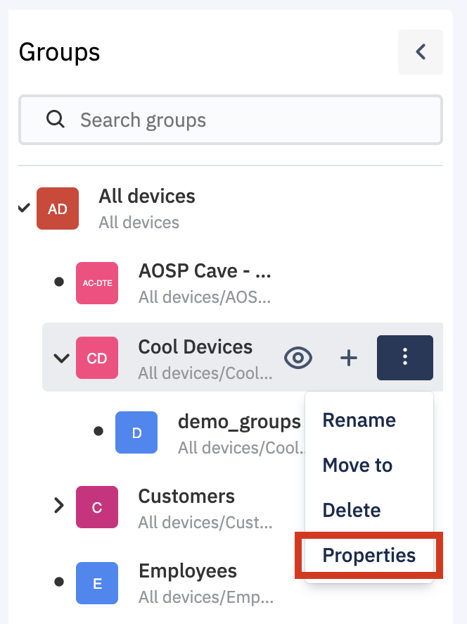
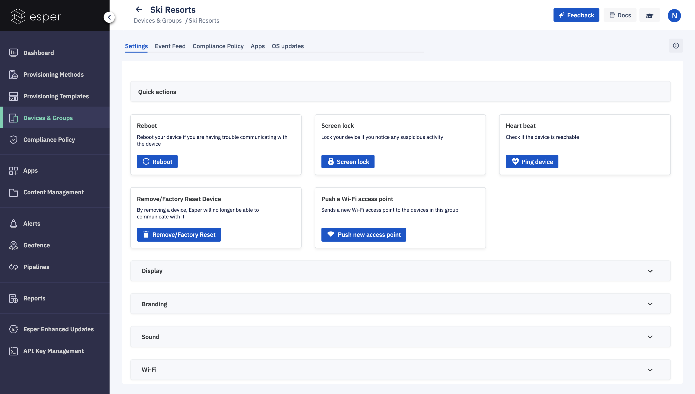

## How to monitor and control an entire group of devices?

  

The Devices & Groups section enables you to manage devices and groups in one place. You can assign devices to groups or move devices/groups from one group to another. Once devices are assigned to groups, you can use a single command to perform an action on all the devices in the group. You can, for example, apply a Compliance Policy to all the devices in the group at once.

We also provide the capability of “Nested Groups” now which is essentially a hierarchical structure of groups that enhances the flexibility of taking actions for devices. Thus introducing two more concepts:

-   *Parent Group* - A group at a higher level of the hierarchy. Users can create multiple parent groups at the same level.
    
-   *Subgroup* - A group at a lower level of hierarchy associated with a parent group. Any action intended for a parent group will be cascaded to all sub-groups as well.
    

By default, there will be an “All Devices” group which will be the parent group for any new groups created. Also, devices are automatically added to this group unless otherwise specified during provisioning via a template. Excluding “All Devices”, five levels of hierarchy are allowed.

### Groups Pane

As groups may be deeply nested, the Groups pane has a dynamic horizontal scroll bar that will appear to be able to pull those groups and their options into view. You can resize the pane by hovering over the vertical bar separating the Groups and Devices panes. You can also use the left pointer to collapse the Groups pane to give you the maximum view for the Devices Pane.

  
  
  

To perform group actions on a group select an existing group, click the eye icon radio button next to its name.

You can also access the same via more icon and then tap view properties.

This will take you to the Group actions you can take on that group - change Settings, view the group’s Event Feed, apply a new Compliance Policy, install or uninstall Applications, or manage Esper Enhanced Android OS updates.

  

  

To view all the devices in a group in the right Devices pane, click on the left side of the desired Group in the Groups pane.

  
  
  

To return back to the main Devices & Groups page, simply click the back arrow to the right of the Group name at the top.

  
