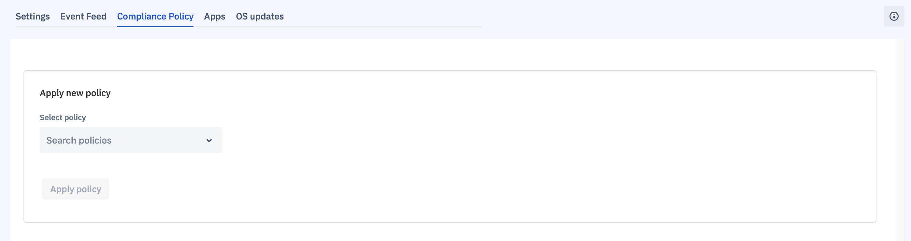
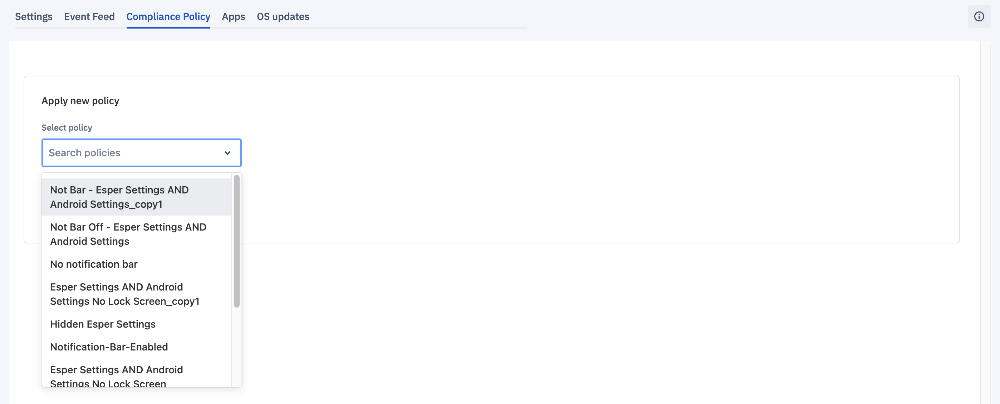
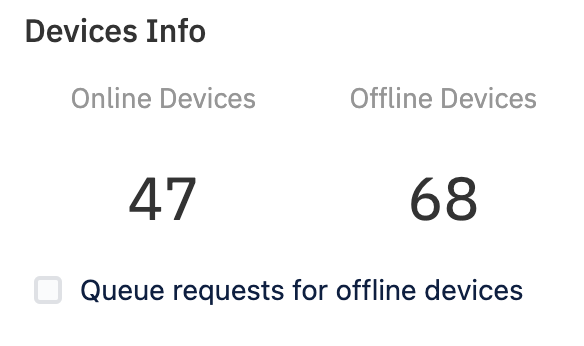

##  How to Manage Compliance Policy on Group of Devices?

  

Compliance Policy lets you apply an existing compliance policy to all the devices in your group. You have two choices for how a Compliance Policy is applied to a Group: apply only to online devices, or queue them for offline devices to apply if they come online for 24 hours after the new policy has been applied.

  

You’ll find more information on compliance policies in the  [Compliance Policy section](../provisioning-template/createtemplate.md).

###  Apply a New Compliance Policy on a Group of Devices

  

Step 1: On selection of the compliance tab you will be given a screen where you could apply a new compliance policy.

  

  

Step 2:  Select a previously created compliance policy from the Select Policy drop-down, you can also search for policies by typing in the box.

  

  

Step 3: A device info preview will be shown to you mentioning how many devices are online and offline.

  

  

Step 4: On the basis of online and offline status, you could choose to queue request to offline devices by tapping on the checkbox.

  

Step 5: A preview of the chosen policy will appear below the box.

  

  

Step 6: Click Apply policy to push the Compliance Policy out to the group. A slide-out appears displaying the status of applying the new policy to the devices in the group.

  

  

**Note**: When you apply a Compliance Policy to a group, all the online devices will receive a command to comply with the policy. If you select the checkbox next to, “Queue requests for offline devices,” the system will queue policy updates to be pushed to all offline devices that come back online within the next 24 hours.