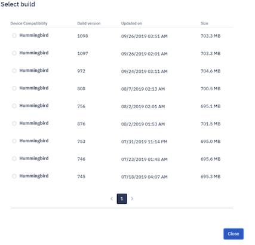

## How to Push OS Updates for a Group of Devices?

The OS Updates section enables you to push operating-system updates to all the devices in the group that run Esper Enhanced Android.

  

  

**Note:** The OS Updates section is only relevant for groups containing only Esper Enhanced Android devices.

To deploy an OS update to all the devices in a group, click Deploy OS Updates.

Click **Select Build** to select one of the available builds.

Click the radio button next to the build you want to deploy.

**Note**: Only the latest 30 builds of the Esper Enhanced Android updates will be available for deployment

The Number of Devices field will populate with the devices in the group on which this update is applicable; that is, the number of devices that have an OS build version lower than the selected version for the deployment. Add the installation name and any pertinent notes and click **Save**.