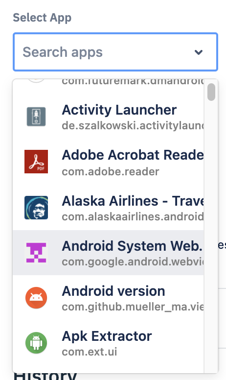
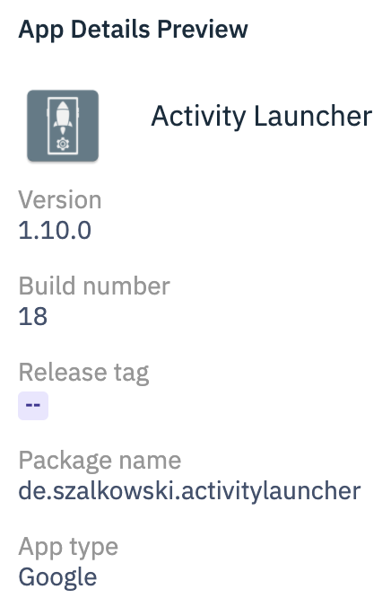
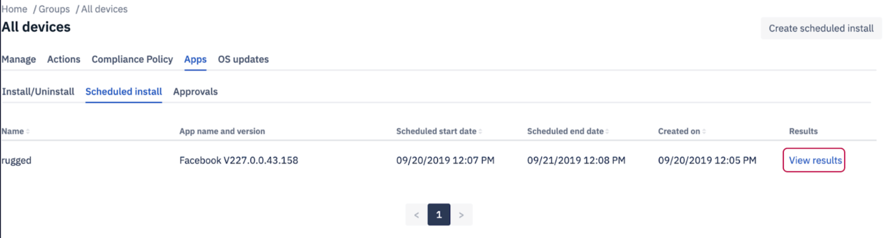

## How to Install/Uninstall an Application on a Group From the Console?

  

The 'Apps' section lets you install or uninstall both privately uploaded applications—also known as Enterprise Applications—and Google Play Apps to the groups immediately. Appliactions can be installed/uninstalled on online devices only.

 ## Install/Uninstall App 

Step 1: To install an application on all the devices in the group select Install from the Select Application Action dropdown.

  
  


  

Step 2: Device info shows the number of offline and online devices.

  


  

Step 3: Select the application you’d like to install from the Select Application dropdown. 

:::tip
You can type the first few letters of the application’s name into the search box to quickly find the application.
:::



  

Step 4: Select application version.If you select the check box for manage configurations, you will be prompted to enter JSON code. 

Managed configurations will allow the administrator to  remotely configure work applications.

  


**Notes:**

  

1.  Manage configurations can be applied to android devices 5.0 or above.
    
2.  All the applications will accept the JSON values—the changes are reflected only on the apps where the JSON values are applicable.
    
3.  Manage configurations cannot be applied to a Google Play store application while installing it. However, an installed aplication can have managed configurations.

Following is a sample code for Chrome (version 86 and above) Manage Configuration:

```
{
    "URLBlocklist":[
    "example.com",
    "https://ssl.server.com",
    "hosting.com/bad_path",
    "https://server:8080/path",
    ".exact.hostname.com",
    "file://*",
    "custom_scheme:*",
    "*"],
    "SafeBrowsingProtectionLevel":1,

    "HomepageLocation":"https://www.chromium.org", "CookiesBlockedForUrls":[
    "https://www.example.com",
    "[*.]example.edu"
    ],
      "DefaultGeolocationSetting":3     
    }
```

Following is a sample code for Chrome (Version below 86) Manage Configuration:


    {"URLBlacklist":[
    "example.com",
    "https://ssl.server.com",
    "hosting.com/bad_path",
    "https://server:8080/path",
    ".exact.hostname.com",
    "file://*",
    "custom_scheme:*",
    "*"],
    "SafeBrowsingProtectionLevel":1,

    "HomepageLocation":"https://www.chromium.org", "CookiesBlockedForUrls":[
    "https://www.example.com",
    "[*.]example.edu"
    ],
      "DefaultGeolocationSetting":3     
    }

Click the links to find more [JSON settings](../miscellaneous/json.md) and [accessibility settings](../miscellaneous/accessibility-json.md). 

You can check the history of application installation/schedules. Click the ‘View’ link under the manage configurations column to see the JSON code.

  


  
:::tip
You can also view the managed configurations by clicking the information icon. On the slide-out, click on the view configuration link.
:::

Step 5: Once you’ve selected an application, its details will appear in the 'Application Details Preview' section.

  




  

Step 6: Check 'Queue requests to offline devices' box if required and click **Install**.

  


  

Step 7: You can check the status of the installation on the slide-out from the right.

  


Group Uninstall works much the same. On step 1, simply select Uninstall from the Select Application Action dropdown.

###  Scheduled Application Install/Uninstall 

This section lets you schedule an application installation or uninstallation for a specific point in the future. To schedule an install, navigate to the  Scheduled Install tab. 

 Step 1: Click on the **Create Scheduled Install** button.


  

Step 2: Enter the schedule details- a unique name for the scheduled installation or uninstallation in the Name field.

:::tip
Name cannot be reused.
:::

  


  

Step 3: Select Install or Uninstall from the Select Application Action dropdown.

  


  

Step 4: Select the application you want to install or uninstall from the Select Application dropdown.


  

Step 5: Use the radio buttons to choose the device’s time or Console’s time when scheduling an application installation or uninstallation for a group.. 

If you choose the Device time, the task is performed according to the device's local time. 


If you choose the Console time, the task is performed according to the Console's local time. 
  


  

Step 6: You can define a recurring schedule by selecting Recurring schedule — for instance, to schedule an application installation every Monday between 2:00 AM and 5:00 AM from May 1st to May 10th.

  


  

Step 7: Select start and end dates from the Start Date and End Date dropdowns and start and stop times from the Start Time and End Time dropdowns. Then click Create **Schedule**.


  
  

Step 8: On successful installation, you can see the status of the action by clicking **View Results**.

  



Scheduled Group Uninstall works much the same. On step 1, simply select Uninstall from the Select Application Action dropdown.  
  
    