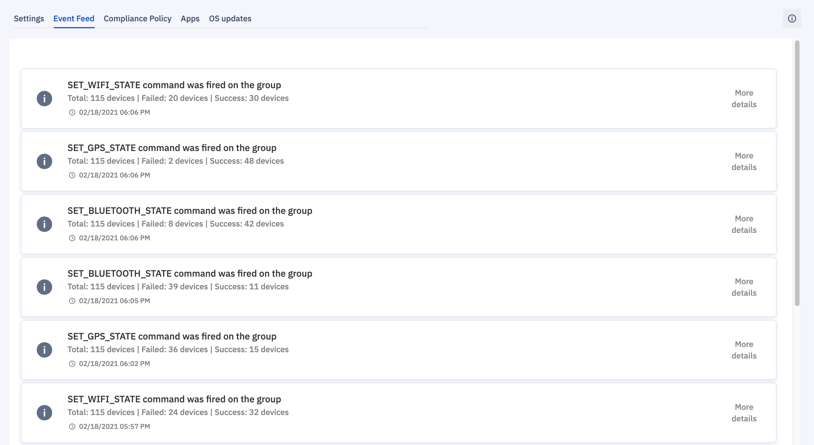
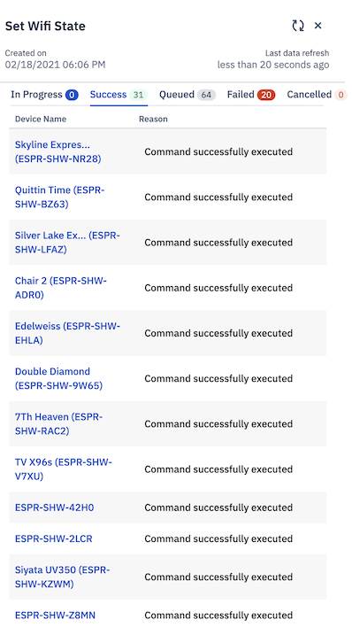

## What is the Event Feed of Group of Devices?

  

The Event Feed tab provides a record of all the actions taken on the group, including details about each event. This is very useful for viewing the status of any queued commands for offline devices.

Clicking on **More Details** next to one of the events listed will cause a sidebar to slide in from the right showing the status of the installation.

