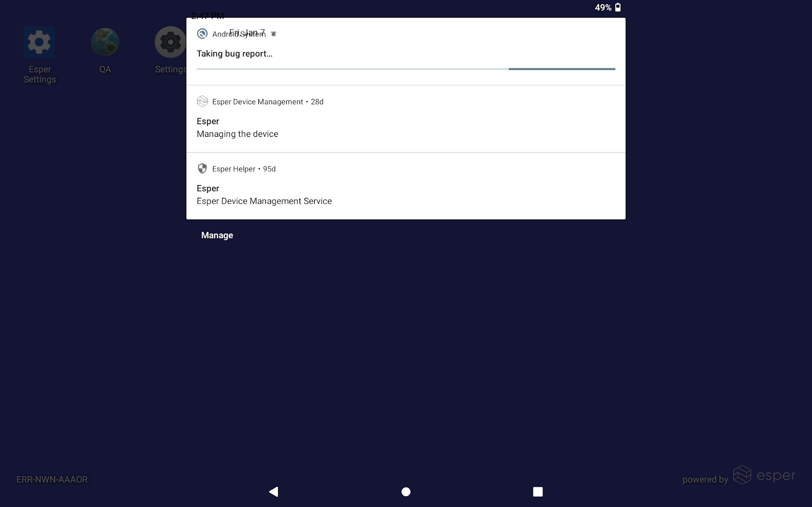
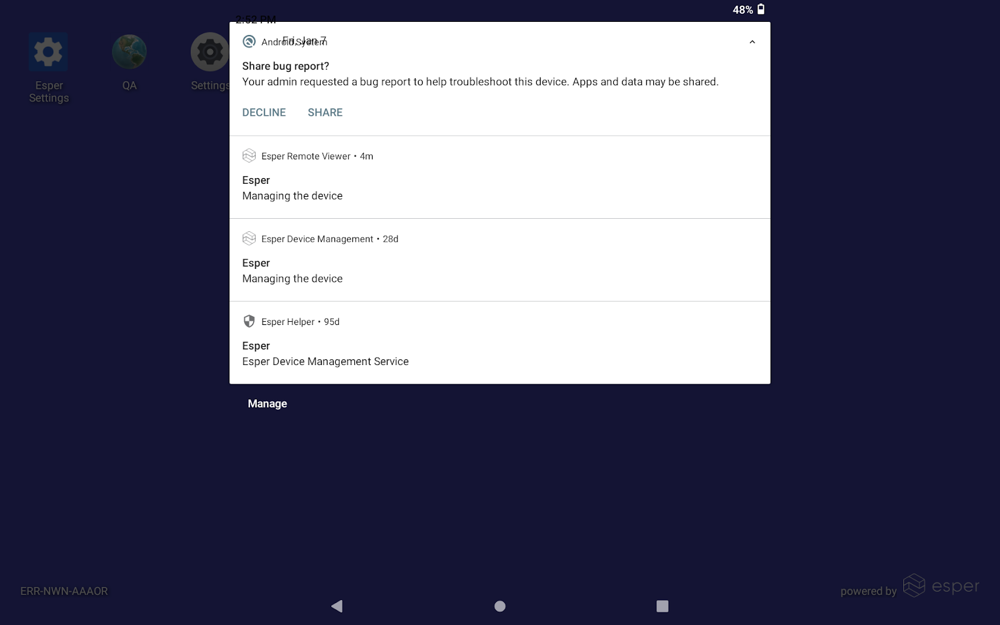
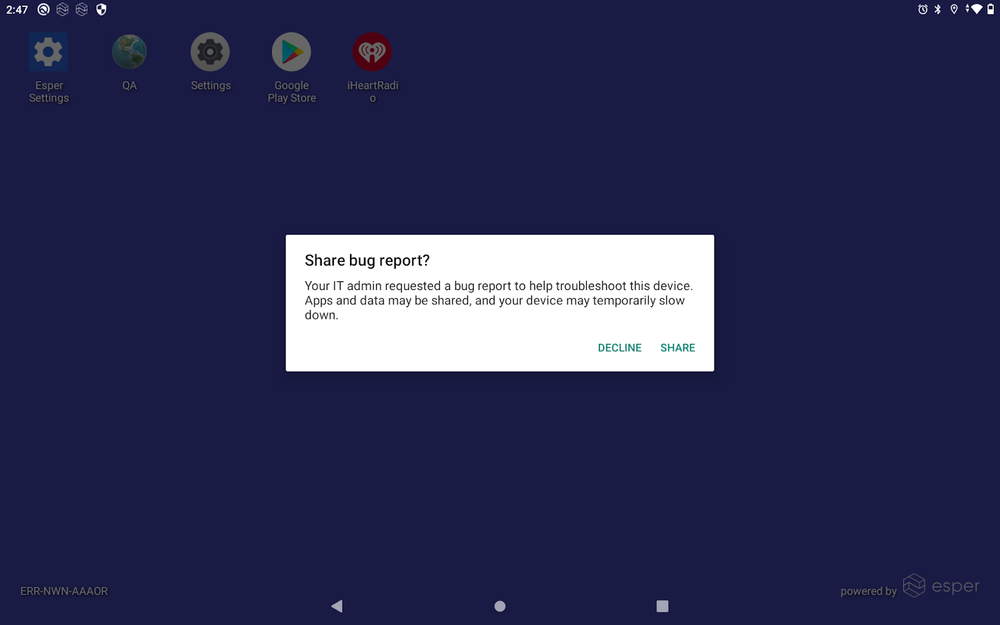
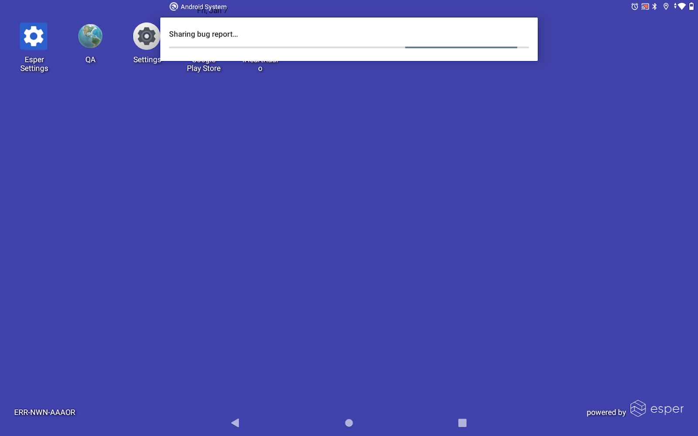
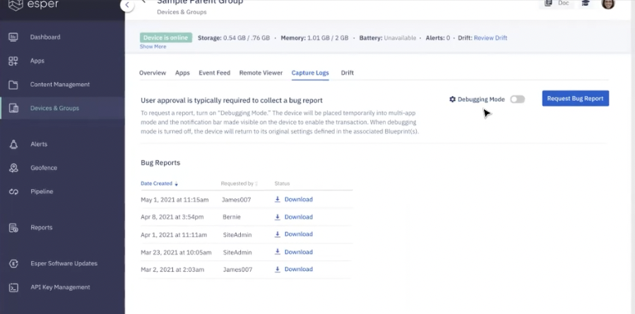
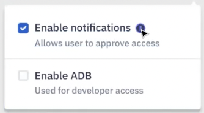

# How to Capture Logs on the Device?

The ‘Request Bug Report’ button allows you to capture and upload a bug report from your device.

:::tip
Once a bug report has been requested the user will need to manually approve this request. Approval requires the device to be in multi-app mode with the notification bar enabled. This can be accomplished by enabling “Debugging Mode”.
:::

You can then pull down the notification bar to track the progress of the bug report request. 

Once the report is ready, the Share and Decline report options will be available in the notification bar.

  

  

Click the notification to open up the following pop-up to share or decile the generated report.

  

  

If the “Share” option is selected, you can track the progress of the bug reports being uploaded in the following pop-up.

  

Once the bug report is uploaded, it will be seen in the Console with an option to download.

For EFA devices, the report will be generated automatically without requiring user consent.

By default Debugging Mode will enable the Notification Bar and place the device into Kiosk mode. The user can also select the gear icon to modify the Debug Mode configurations to include enabling ADB. When Debugging Mode is disabled the device will return to the configuration defined in its Blueprint.

