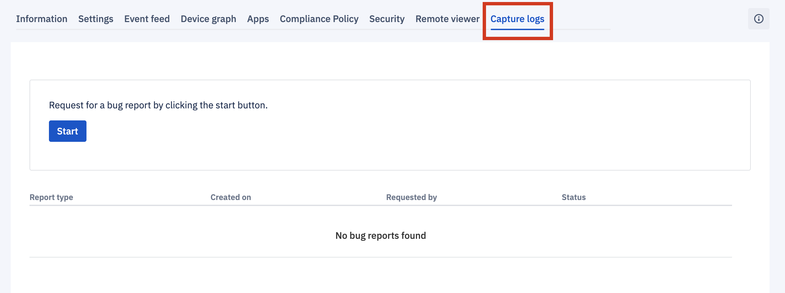

## How to Capture Logs For a Single Device?

  
Capture bug reports to diagnose your devices. Bug reports can be enabled through mutli-app. A notification will appear requesting permission before each device can upload the report to the console. 

  

  

### Generating a Bug Report of a Device From the Console

  

Step 1: To generate a report, go to the ‘Capture logs’ tab and then click on **Start**.

  

Step 2: As the report is gathered, the status will change from Requesting Report to Permission Granted to Download.

  

  

Step 3: The Download status is a live link. Clicking on Download will download the bug report with the date and timestamp for the device to help your technical staff debug any issues.

When you request a capture log from a specific device, a notification will pop up on that device asking permission to share the report. The device user need to swipe down the notification bar, tap the bug report line, and click **Share**. If the device user clicks **Decline**, the report will not be shared and the status will change to Permission Denied by User.

