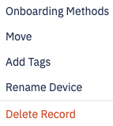
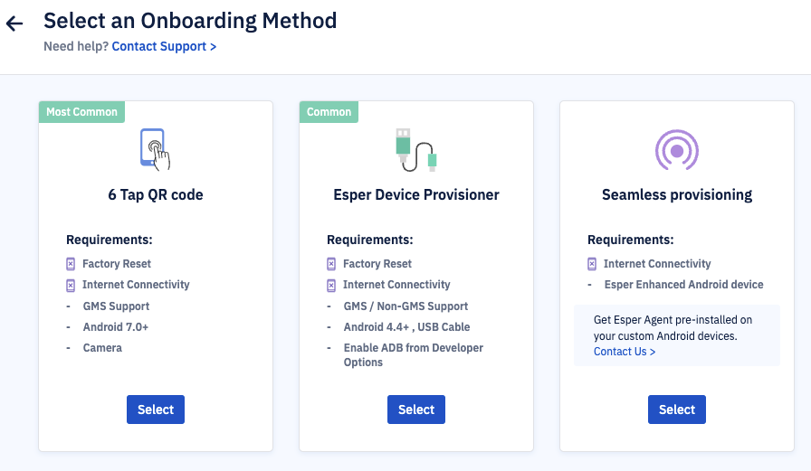
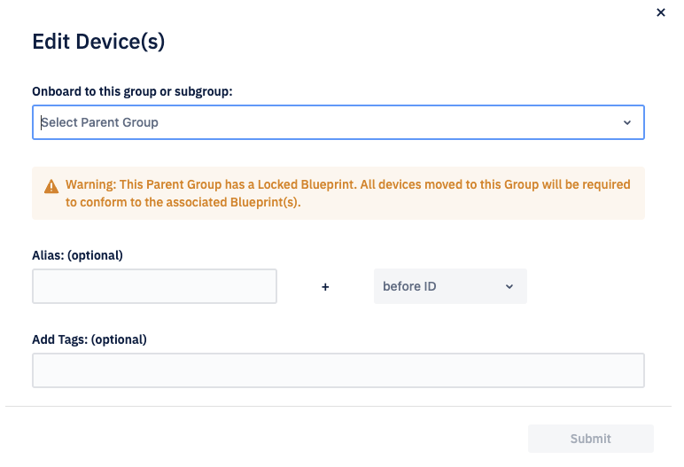
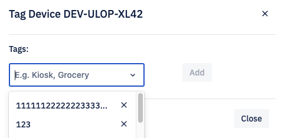
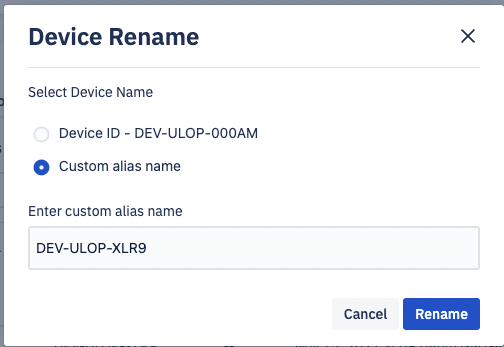

# What Actions can be Performed on the Devices that are Ready to Onboard?

  

Navigate to the Directory view> Select Unmanaged Devices> Ready to Onboard. Click the ellipsis (...) for a selected device.

## Onboarding Methods

Select 'Onboarding Methods' from the drop-down. This option will open a pop-up to select the onboarding method.

Click select for the [Onboarding method](../provisioning-methods/README.md) you wish to use. This will walk you through the process.

## Move

Select 'Move' from the drop-down. This action allows you to move a device from the director or Parent Group to another. Select the destination group from the dropdown, add optional details and click Continue.

## Add Tags

Tags make it easy to identify devices in a specific location, type, Wi-Fi, or SSID. You can add upto 5 tags. Select 'Add Tags' from the dropdown. You can add a new tag or select from a list of already added tags.

Click ‘X’ to remove the existing tag. Deleting a tag will also remove it from all devices with that tag. We display a warning that the action will remove this tag from any tagged device. When a tag no longer exists on any device, it will be deleted from the dropdown.

  

## Rename Device

Choosing the ‘Rename Device’ option from the dropdown allows you to select the device ID or add a Custom Alias name for the device.

 

Click Rename to change the alias name.

:::tip

You cannot change the device Id. When you rename a device, you are adding an alias name.
:::

  

## Delete Record

Deleting the record will reject approval for onboarding and permanently remove the record from your endpoint. If another attempt is made to onboard this device, you may need to approve or reject the request again.

:::tip
A subset of the actions mentioned above— Move and Delete Records— is available when you select multiple devices.
:::