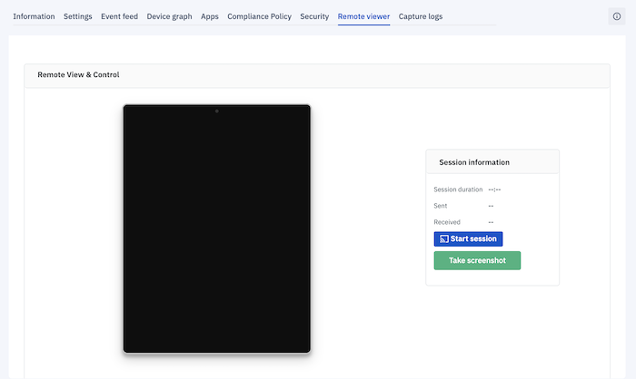
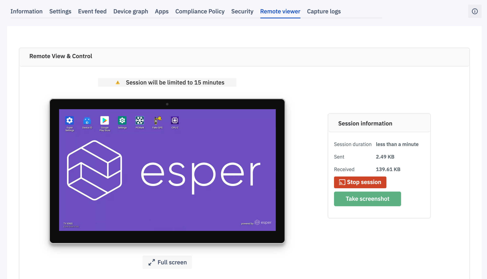
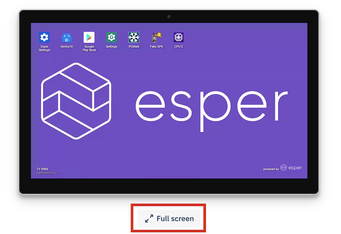
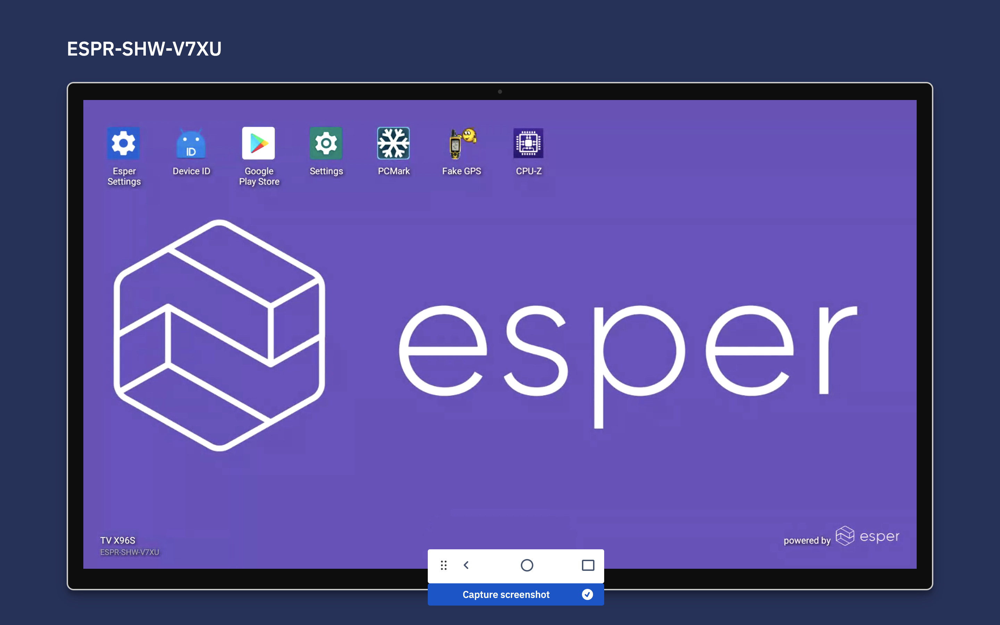
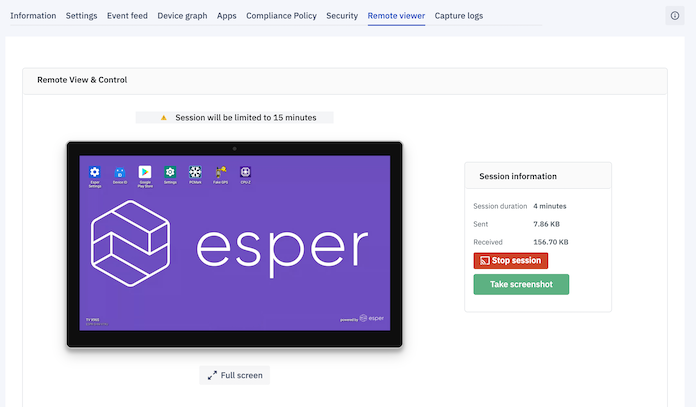
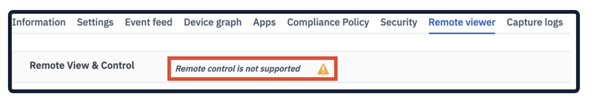
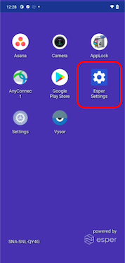
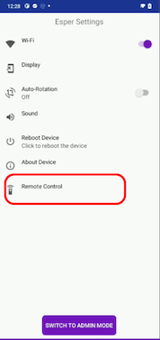
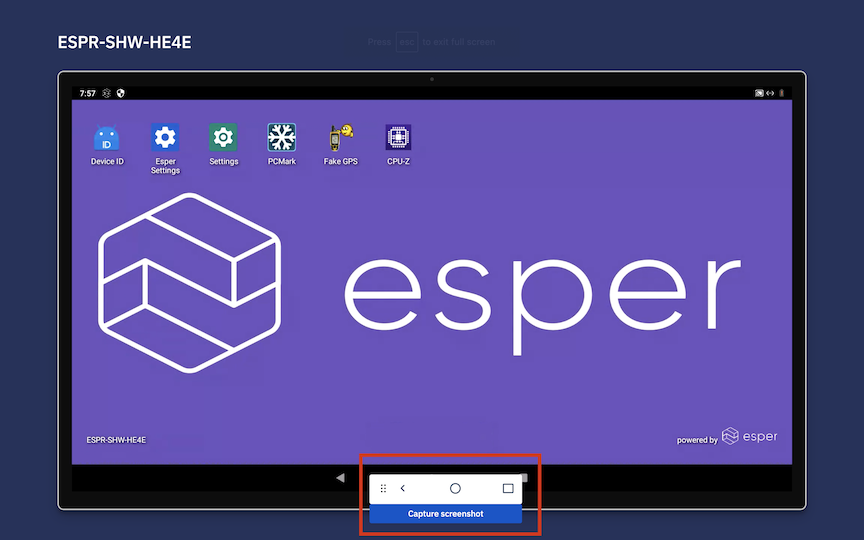

## How to Access a Device using the Remote Viewer and Control?

Remote Viewer enables you to view the  device's current screen on your Console. The Control allows you to take control of the device. This means you may interact with the remote device using your mouse as though you were physically touching the screen. In this section, you can also take screen-shots.

:::tip
If you want to use remote control functionality on devices, please contact the Esper team for a [Supervisor plugin](../miscellaneous/supervisor.md). 
:::

**Note:** Only a single device-to-Esper Console session is allowed at a time. 

If you have the ‘Viewer’ role, you can remotely view the device. However, you won’t be able to control the device.

### Setup Remote Viewer on a Single Device
 

To set up Remote Viewer follow the steps:

  

Step 1: To remotely view a device, click on **Start Session**.

  

  

:::tip
You can start a remote view session only if the devices is online.
:::

On devices using Android 9.0 and above, the Esper Console will establish a secure connection with the device, and the device's screen will be streamed to the Console.

There will be a prompt requesting for remote view. Once the remote view request is allowed, a secure connection will be established, and the device's screen will be streamed to the Console.

:::tip
The session will end automatically after 15 minutes.
:::

  
To end the session earlier, click **Stop Session**.

The Full-Screen button allows you to remotely view the device in full-screen mode.

While in Full-Screen mode using Remote Control, a widget at the middle of the screen will enable navigation on a remote device that has hard keys. If the control widget happens to overlap with the frame, grab and move it to clear space on the Console screen. 

To exit the Full-screen view, simply press esc on your PC’s keyboard.

:::tip
For Esper Agent versions below 7.5.0005, Remote Viewing will work, but Remote Control won't work through accessibility service. However, the Remote Control and Remote Viewer will continue to work with the supervisor and Knox.
Click [here](./agent-version.md). if you need help finding the Esper Agent Version.
:::

### Capturing a Screenshot on a Device

Step 1: Click the **Take Screenshot** button to capture the current device screen.

There is a recorded history of all screenshots captured per device at the bottom of the Remote Viewer section.

  
### Setup Remote Control on a Single Device

On Esper Foundation for Android Devices or devices that have a manufacturer signed Esper Agent in the system, there is an option to Remote Control the device.  

:::tip
Please make sure the device is unlocked before you start the Remote Controller session.
:::

Since Esper has obtained membership in SEAP (Samsung Enterprise Alliance Program), our platform now supports Samsung Knox-specific extensions. We provide the Remote Control feature available for any Esper provisioned Samsung devices running Knox 3.x or newer. If the remote control option is not supported for your device, we display a message in the Remote view.

If you see the error message, perform the following:

  

1.  Got to the Esper Settings on your device.
    

2.  Click the ‘Remote Control’ option.
    

3.  Now enable Remote Viewer.
    

On the pop-up, you will be asked to confirm your choice. Click **OK**.

:::tip
You can use the remote control in both view modes: Full-screen and non-full-screen.
:::

### Hardware Keys and Keyboard Events

Some devices do not have soft keys for home, back, and recent and they use physical keys on the device instead. On such devices, a virtual set of keys appear at the middle of the Remote Control screen. When in Full-screen mode, the widget includes the hard keys. You can grab and move the widget to a different location on your screen as you wish.

Additionally, we have enabled keyboard events so users can use the keyboard on their system to type, and are not forced to use the keyboard on the device.