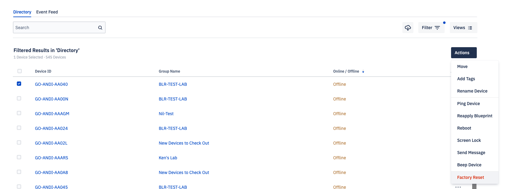

# Removing a Device from the Console

Sometimes, you need to remove devices from the Esper Console. Those devices may be in storage or you may want to completely remove them from your fleet. In those instances, you can delete those devices from the console.

Any devices deleted in this way will need to be reprovisioned if you want to add them to the Console again.

Save time and create a new group to delete devices. Move those devices into the group and complete a removal in just a few clicks. We recommend separating devices into offline and online groups.

**In this article:** 

[[TOC]]

## Removing Offline Devices

**Step 1** Locate the Device or Group

Locate the group or device you’d like to remove. Then, select Factory Reset from the Actions heading by pressing the ellipses (...) or by selecting the devices and clicking the Actions button if in a group.

**Step 2** Remove / Factory Reset the Devices

Deselect both “Factory Reset the Devices” and “Wipe External Storage”. Also be sure to check Delete Record to delete the device from the Console. You may need to wait a few seconds for this option to appear.

::: tip

Esper software will stay on the device if “Factory Reset the Devices” or “Wipe External Storage” are selected. In that case, the device won’t be removed from the Console.

:::

**Step 3** Check If the Device Was Removed

We recommend searching for the device once the removal process is complete. The message “No devices matching this search criteria” should appear.

Removing offline devices will keep the console decluttered so you can focus on your online devices.

## Removing Online Devices 

**Step 1** Locate the Device or Group

Locate the group or device you’d like to remove. Then, select **Factory Reset** from the Actions heading by pressing the ellipses (...) or by selecting the devices and clicking the Actions button if in a group.

**Step 2**  Remove/Factory Reset 

You may optionally choose to factory reset and wipe the device storage if the device is online. Be sure that Delete Record is checked to delete if from the Console. Then press **Continue**.

## When the Remove Device/Factory Reset Option is Disabled

If the Factory Reset/Remove Device option is disabled, that means the device cannot be removed from the Console. There may be a setting on it that prevents it from being factory reset in the Console. 

To reset or remove these types of devices, you’ll need to have the device on hand. Then, open Esper Admin settings and select Factory Reset from the device.