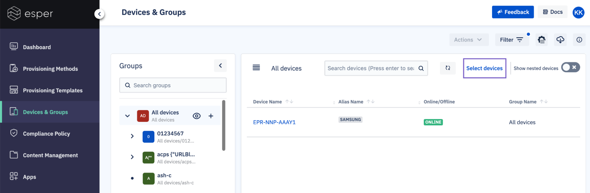
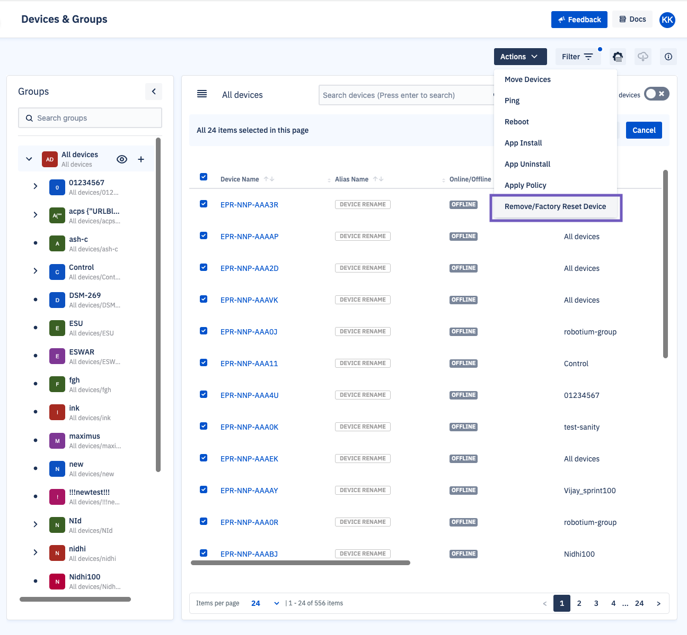
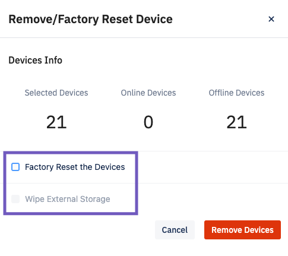

# Removing Offline Devices from the Console

Sometimes, you need to remove devices from the Esper Console. Those devices may be in storage or completely removed from your fleet. In those instances, you can delete those offline devices from the console. 

::: warning

Any devices deleted in this way will need to be reprovisioned if you want to add them to the Console again.

:::

To remove devices from the Console: 

**Step 1** Select Devices 

Go to **Devices and Groups** > **Select devices**.  Then, select the devices you’d like to remove. 

**Step 2** Remove / Factory Reset the Devices

Click on the **Action** drop-down menu, and select “Remove / Factory Reset Device”. 

Deselect both “Factory Reset the Devices” and “Wipe External Storage”. 

::: tip 

Esper software will stay on the device if “Factory Reset the Devices” or “Wipe External Storage” are selected. In that case, the device won’t be removed from the Console. 

:::

**Step 3** Check If the Device Was Removed 

We recommend searching for the device once the removal process is complete. The message “No devices matching this search criteria” should appear. 

Removing offline devices will keep the console decluttered so you can focus on your online devices. 
