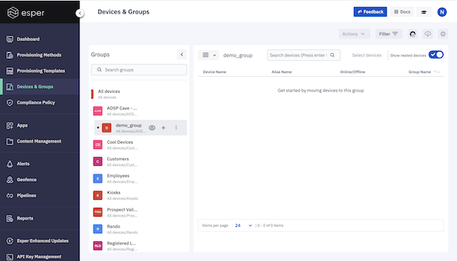
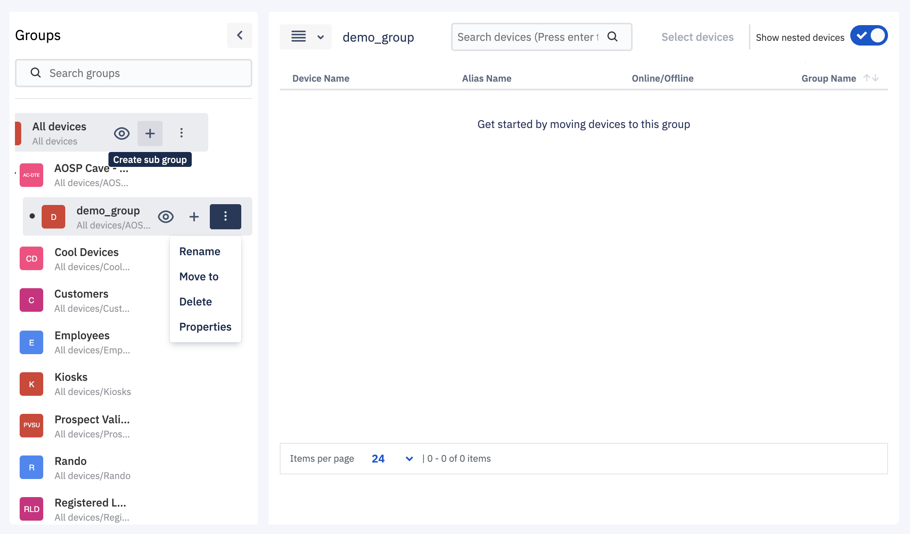
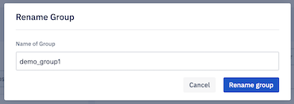
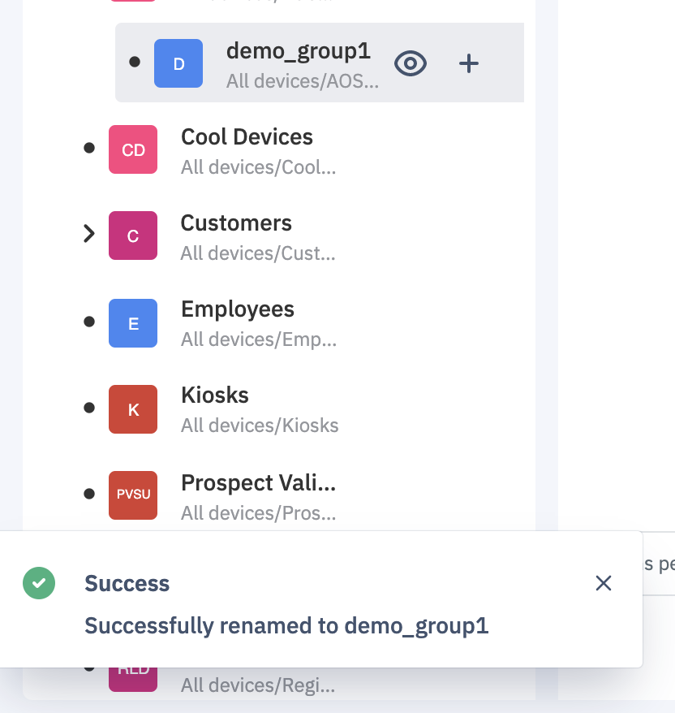

## How to Rename a Device Group?

  

You are allowed to rename any device group except the “All devices” group which is a system group.

  

Step 1: Identify the group level which you wish to rename.

  

  

Step 2: On hover, Click on the ellipsis icon to see more actions.

  

  

Step 3: On click of the rename option, you can enter the new name in the ‘Rename Group’ popup. Once done, click on the **Rename Group** button.

  

  
  
  

Step 4: You will get a toast success message that your device group is renamed.

  

