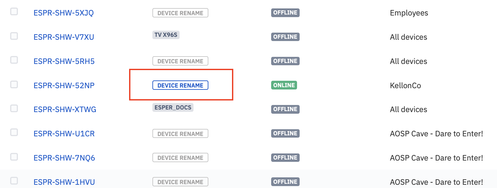
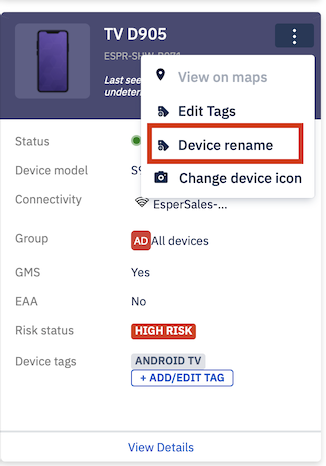
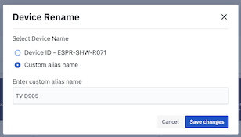

## How to Rename a Device?

Esper allows you to rename any device in the List View and in the Grid View. Below are the instructions to rename a device:

  

Step1: Select the device you want to rename from the right pane of the ‘Device & Group’ screen. Click on the **Device Rename** button.

  

:::tip
You can only rename online devices.
:::

  

  
:::tip
In the grid view, click on the ellipsis to see the "Device Rename" option.
:::

  

Step 2: On the popup, select the Custom alias name radio button and enter the new name.

  

  

Step 3: Click the **Save Changes** button to rename the device.