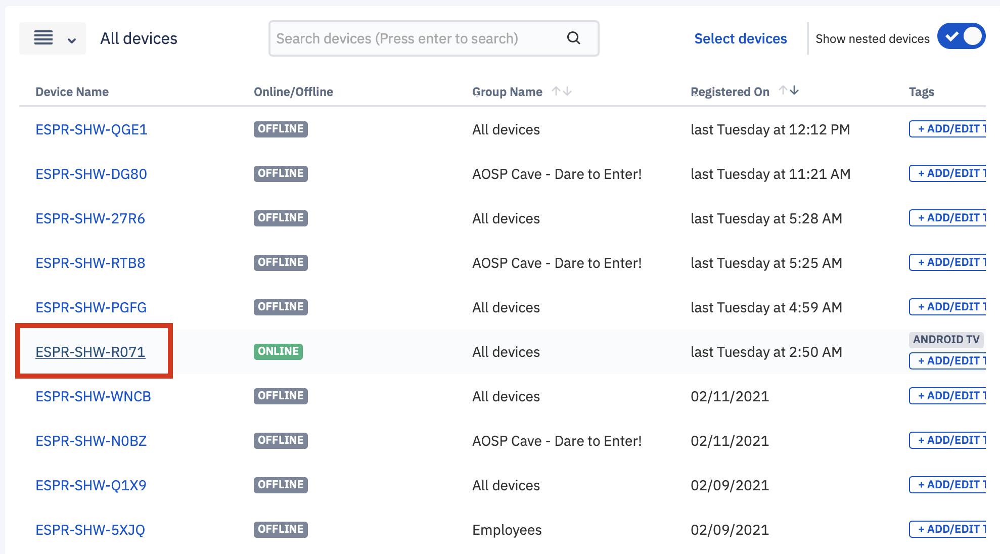
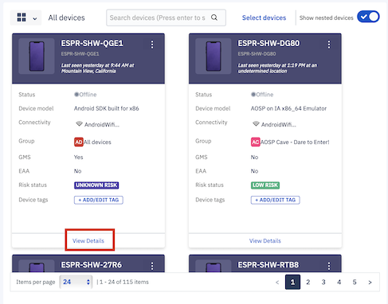
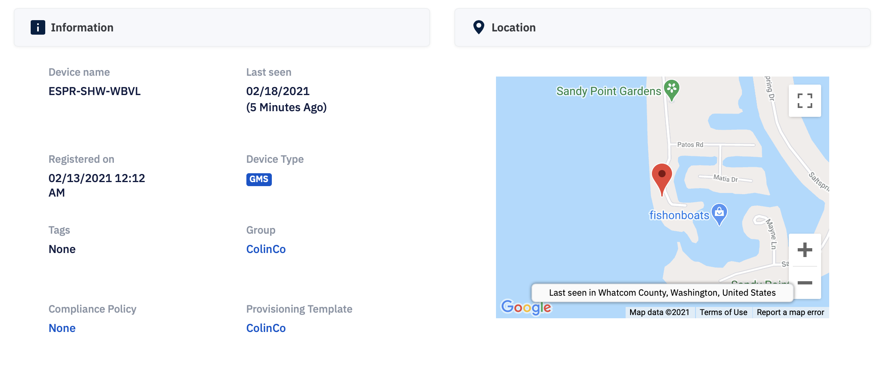
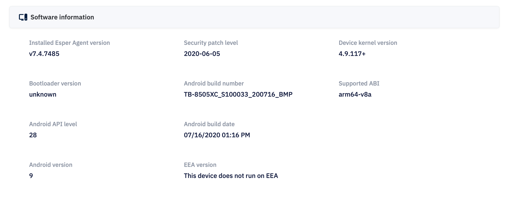
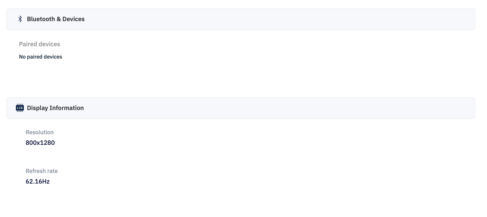

## What is the Static Device Information for a Single Device?

Static information gives you all the details about the device. You can click on **View Details** on device tile in a grid view or device name in the list view to access device information details.

  

  

You will see the below options and the first tab will show you all the static device information of the device you selected.

  

  

Under the information tab, device details are organized in the following categories to make navigation and searchability faster:

  

-   Storage, Memory, and Battery information
    

  

-   About information
    

  

-   Software information
    

  

-   Hardware information
    

  

-   Network information
    

-   Bluetooth and Display information
    

  

