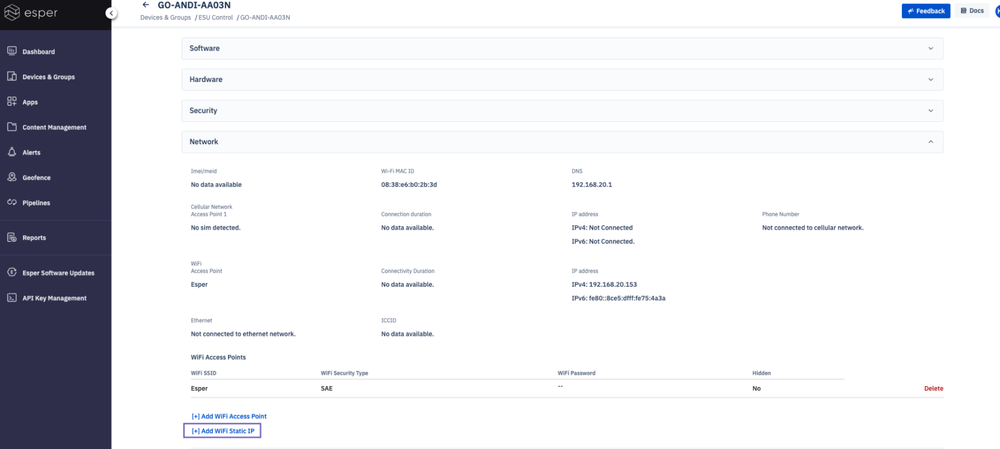
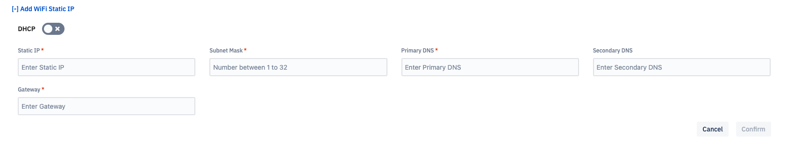

# How Do I Set a Static IP?

This guide walks you through the process of setting up a static IP on a device. Not every device fleet will need static IP addresses, however, some fleets may need a static IP for security reasons. Discuss with your organization if static IP is right for your fleet.

**Product Requirements**
- Must have Administrative Privileges

**Device Requirements** 
- For Ethernet, you’ll need an Esper Foundation for Android device (also known as an x86 device) running on the SDK 3.0+. 
- For Wi-Fi devices, you'll need an Android version 6-11.

The devices you’re setting up Static IP for will need to be connected to Wi-Fi regardless of whether you’re using Ethernet or Wi-Fi. The Static IP configuration can only be set to the current Wi-Fi network that the device is connected to. A new Wi-Fi connection cannot be configured as Static using this feature.

To configure a different Wi-Fi connection as Static, connect the device to that network and then configure the Static IP (IP, Gateway, etc.) through the console.

Locate the device you’d like to configure in Devices & Groups. Open the Network section and press **Add WiFi Static IP**.

Disable DHCP. 

Next, enter the following information: 
- The Static IP you’d like to connect the drive to.
- The Subnet Mask. Input the prefix length (1-32). Refer to the [conversion chart for more information](https://kb.wisc.edu/ns/page.php?id=3493). 
- The Primary DNS 
- Optional: A secondary DNS
- The Gateway IP address. 

Then press **Confirm**. 

The device will attempt to connect to the Internet using the provided static IP configurations in the current network. If the configurations are incorrect or if the device cannot connect to the Internet using the provided configurations, it will default to the previously configured (working) IP settings in a Static IP manner.
