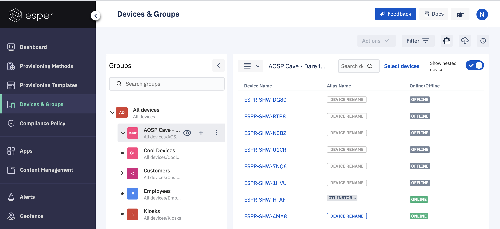
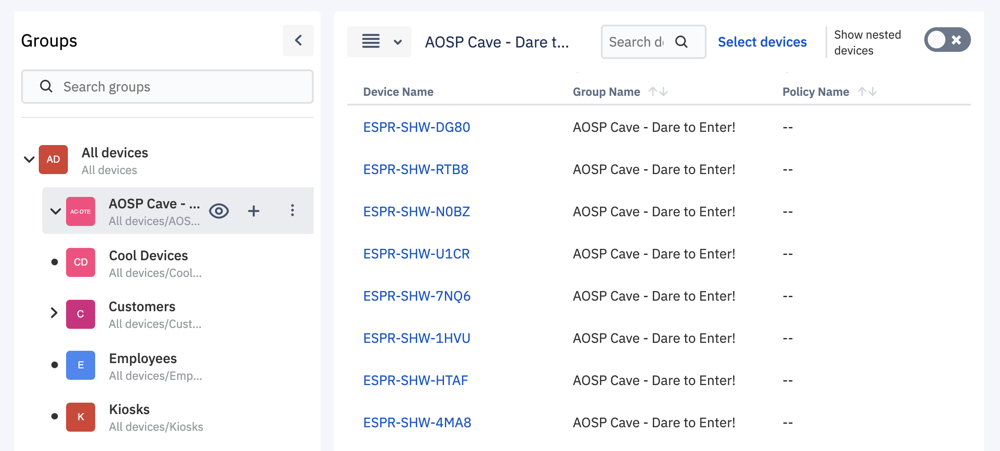

## How to Switch to See Only Immediate Devices Provisioned to a Group?

  

When you select any device group from the left pane of the ‘Devices and Groups’ screen. On the right-hand side, we show you all the devices provisioned by that parent group. No matter the devices are provisioned directly to selected groups or devices provisioned under It’s any subgroup.

  

However, if you can control only the directly provisioned devices and not the other sub-hierarchy devices. Toggle the **Show nested device** to switch on the top right corner to control the hierarchy to immediate or to subgroup level.

  

  

When the switch is ON, you can see all the devices in the group selected from the left section as well as the devices in the sub-group. If the Show nested device switch is OFF, you will only see the immediate device provisioned to the selected group.

  

