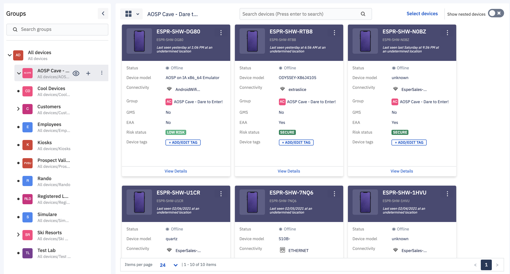
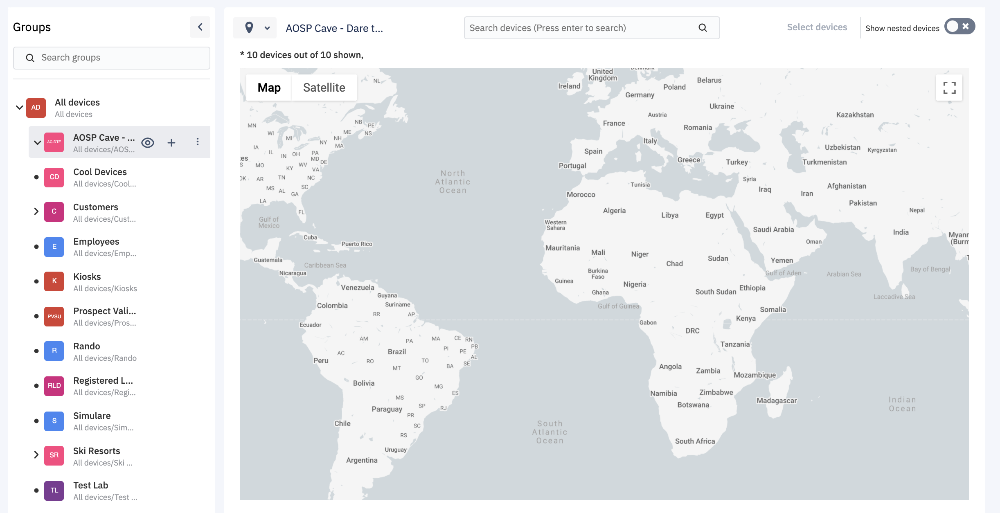
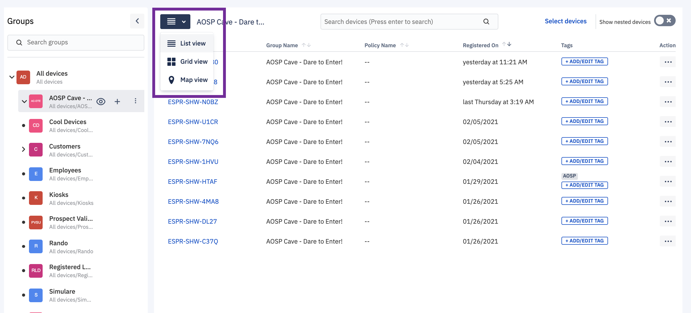

## Switch Between Grid View, List View, and Map View

  

In the ‘Devices and Groups’ section, we provide three different views. You can switch between these views by clicking on the three lines in the right pane of the ‘Device and Group’ screen.

  

  
  

Following are the three ways to view the devices in your Console:

-   Grid view- This view allows you to see the devices as icons.
    

  

  
  

-   Maps view- This view allows you to see the location of the device on the map.
    

  

  

**Note**: In the map view, you can see a maximum of 500 devices. If in case you have more than 500 devices, you can filter devices less than or equal to 500 to see a map view.

-   List view- This is the default view. The devices are displayed as rows in this view.
    

  

