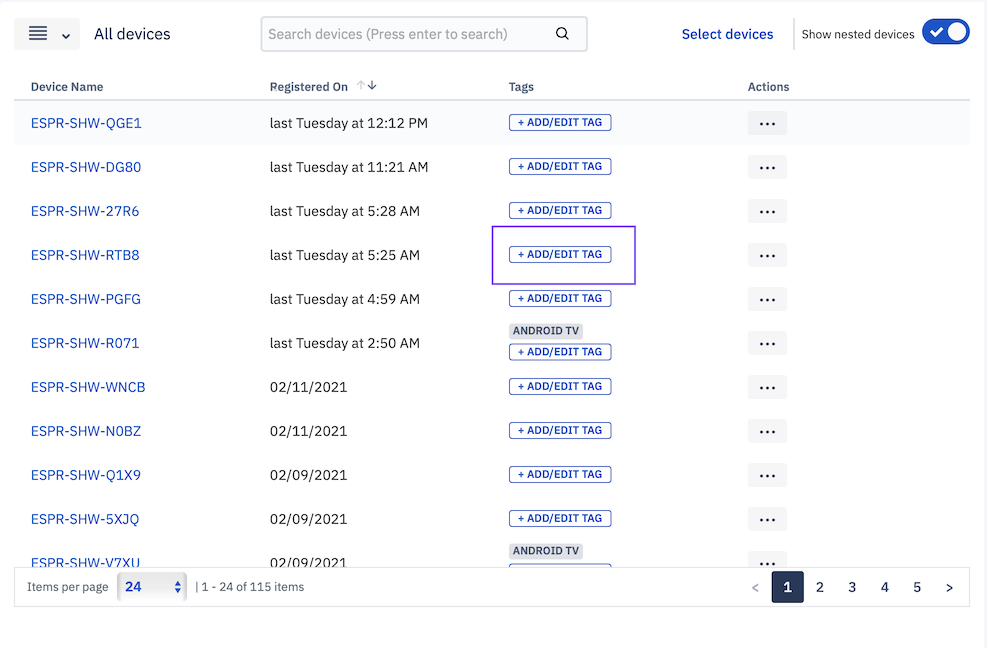
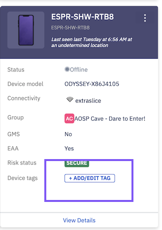
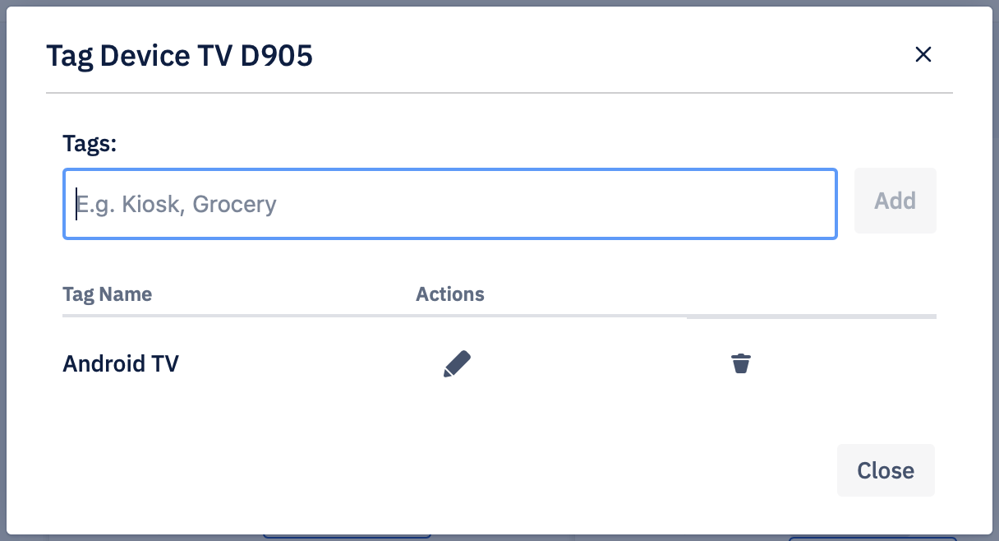
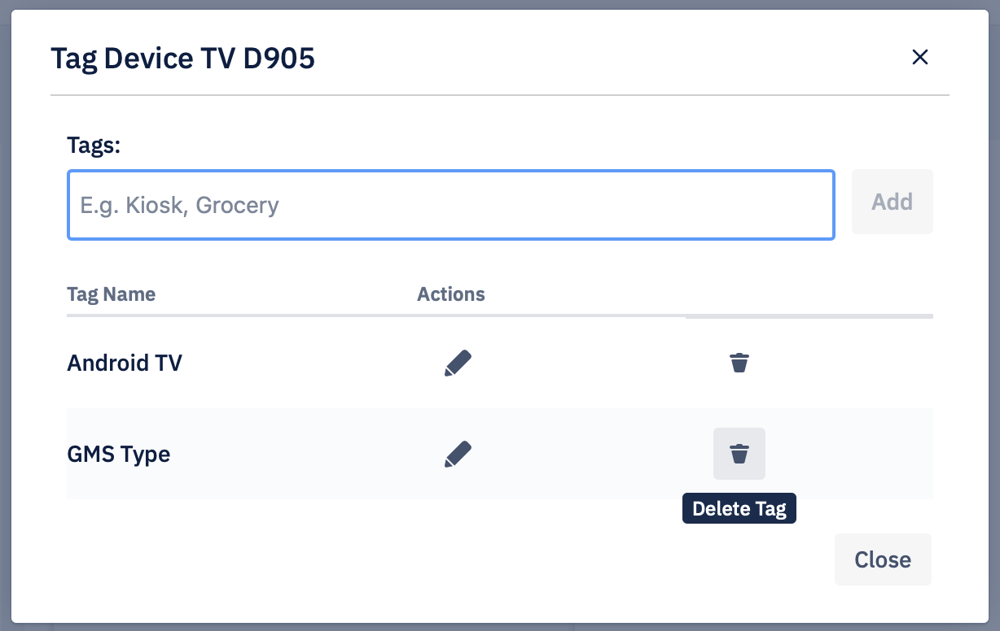

## How to Add, Edit, and Delete the Tags to a Device?

  

Tags make it easy to identify devices in a specific location, type, Wi-Fi, or SSID. Tags can be added to a device in both grid view and list view. You can also click on the **+ ADD/EDIT TAG** button on the tile to add or edit tags. If a tag already exists for a device, the drop-down under action choice changes to Edit Tags.

Step 1: Click **+ ADD/EDIT TAG** either in list view or grid view.

  

:::tip
You may need to scroll to the right to find the ADD/EDIT tag button in the list view.
:::

  

  

Step 2: In the popup enter the tag name, and click **Add** button. Your tag will be saved.

  

:::tip
You cannot add more than 3 tags to a device.
:::

  

Step 3: Click on the pencil icon to edit a tag.

  

  

Step 4: Click on the delete icon to delete a tag.

