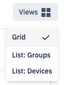
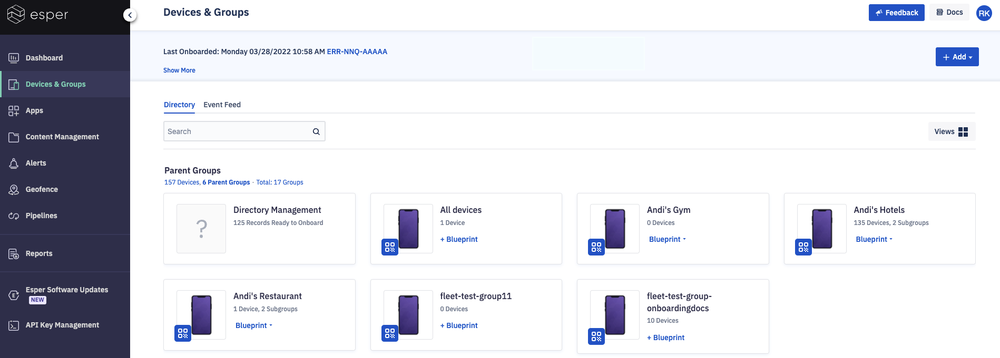
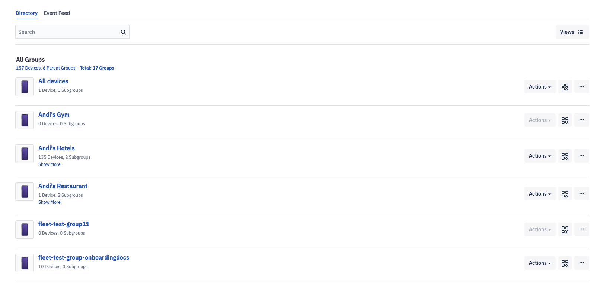
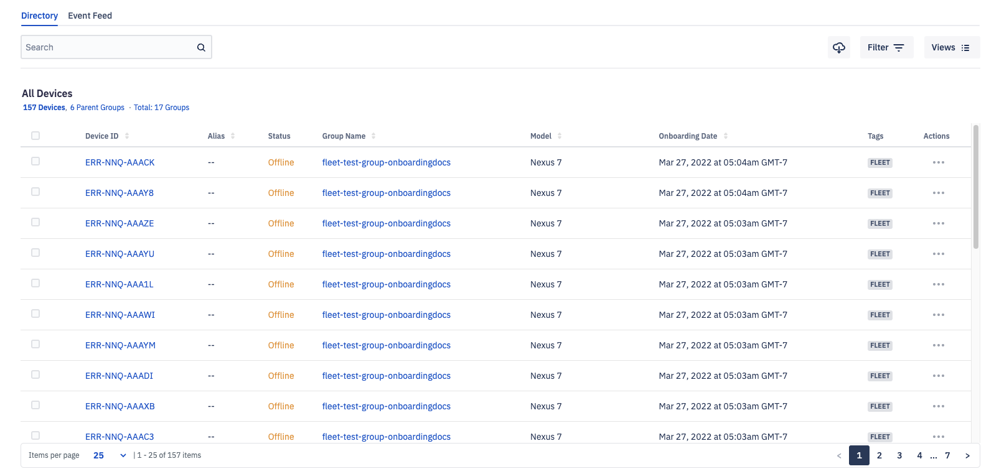
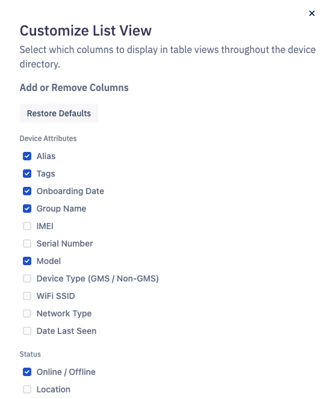

# What Are the Different Device Views?

The Directory allows you to manage the nested architecture and oversee your fleet status using a variety of views. You can freely move between views by selecting it from the top right side of their screen. 

Each view provides different benefits depending on your use case. The grid views offer a compact, high-level view of your entire fleet, broken down by Parent-level Groups. The List views provide a more detailed view of your Parent Groups and nested Subgroups. List views also allow you to fire commands to Groups or individual devices without having to separately navigate to each device.

## Directory-level:

The top section for all the views at the Directory-level display a summary of the entire fleet. The ‘Show More’ link will display the most recent devices in each category.

You can scan the QR code to onboard devices directly to the Directory. However, onboarding to groups is an efficient way to begin onboarding devices automatically when the group has a Blueprint applied. If you scan the QR code for the directory, that device will not be associated with any group and you cannot automate device management until a device is moved into a group. Following are the view available at the Directory level:

  

-   Grid- This is the default view, providing an overview of the fleet at the Parent Group level. You will see the parent groups as tiles.
    

Each Parent Group tile provides an overview of the devices and subgroups within it, and provides quick shortcuts to onboard new devices, add, view, or edit the group’s Blueprint.

-   List: Groups- This view displays a list of all the groups, including nested subgroups. It gives you specific details about the devices and allows more actions to be performed.
    

-   List: Devices- This detailed view lists devices individually, highlighting their onboarding and online status, as well as organizational information, like group name and tags. Clicking Device Id will take you to the device details screen.
    

## Parent Group and Sub-groups:

Each view at the Parent-level and the sub-group level displays the summary of the number of devices and the subgroups. It also displays the description if added while creating the group. You can scan the QR code to onboard a device to this Parent Group. You can also add, edit, and view a blueprint. 

Parent-level and sub-groups have the same view as the Directory level with one addition— Customize List View. 

  

-  Customize List View- This view allows you to choose your custom display for listing the devices. You can choose different colums to display here based on your use case. 

