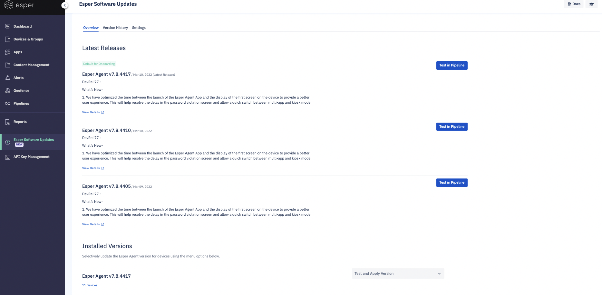

## What are Esper Enhanced Updates?

:::warning
On free Esper plan, this feature is not available by default. If you need this capability, reach out to [Esper](https://support.esper.io/s/) to upgrade your plan to Esper Architect.
:::  

Esper Software Updates gives you the flexibility to stay up-to-date with Esper Software and leverage new functionality enabled by the platform when you want.

  

The landing page displays the details of the three latest Esper Agent releases. You can create and test a pipeline for each of these versions.

This page also has a summary and the devices count of the various Esper Agent versions installed on your fleet.
