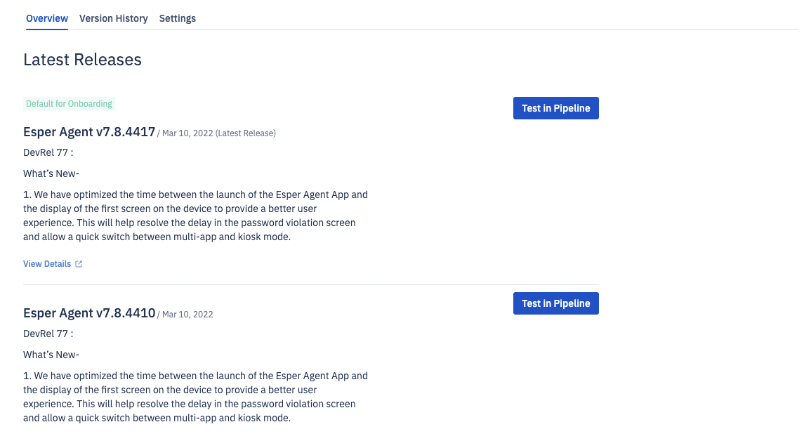
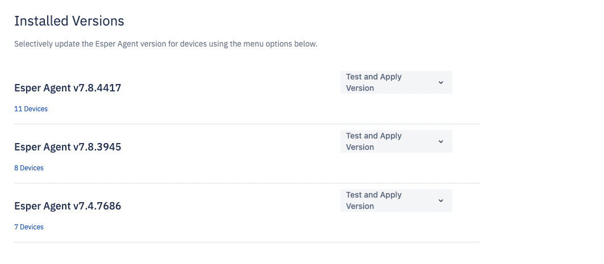
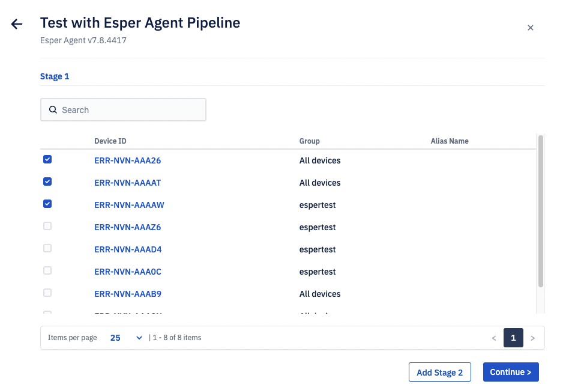
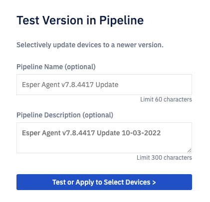
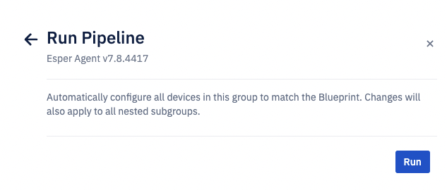

# How to Deploy an Esper Agent Version to the Device Fleet?

You need to use a pipeline to automatically deploy the selected Esper Agent Version to your device fleet. Pipelines allow the user to properly stage, test, and deploy Esper Agent updates before updating their whole fleet. You can select a templated pipeline from:

1.  Latest Releases and the Version History tab

    
2.  Installed Versions
    

Select the device count and version you want to update to and click the corresponding arrow. This will launch a templated pipeline experience with pre-filtered devices.

  

By default, the template pipeline will have one stage. You can add more stages to stagger Esper Agent install on your device fleet— max of 3 stages. When ready, click **Continue**. Enter the optional fields and/or click **Test or Apply to Select Devices.**

  

Select Run to execute the pipeline now.

