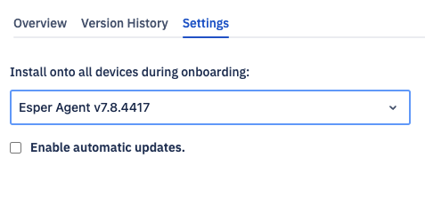

# What is the Settings Tab?

The settings tab allows you to disable automatic updates.
  

If the Enable automatic update is selected, the devices will automatically update to the latest released Esper Agent version and any new onboarded device will have the latest Esper Agent. If this setting is not set, the fleet will never get updated; you must manually push the update via a pipeline.  
The “Install onto all devices during onboarding” option allows you to configure which Esper Agent version you want to install when onboarding a new device. You will be able to choose from the 10 most recent releases. If you have an older Esper Agent installed on the devices infield, then those versions will also be available.
