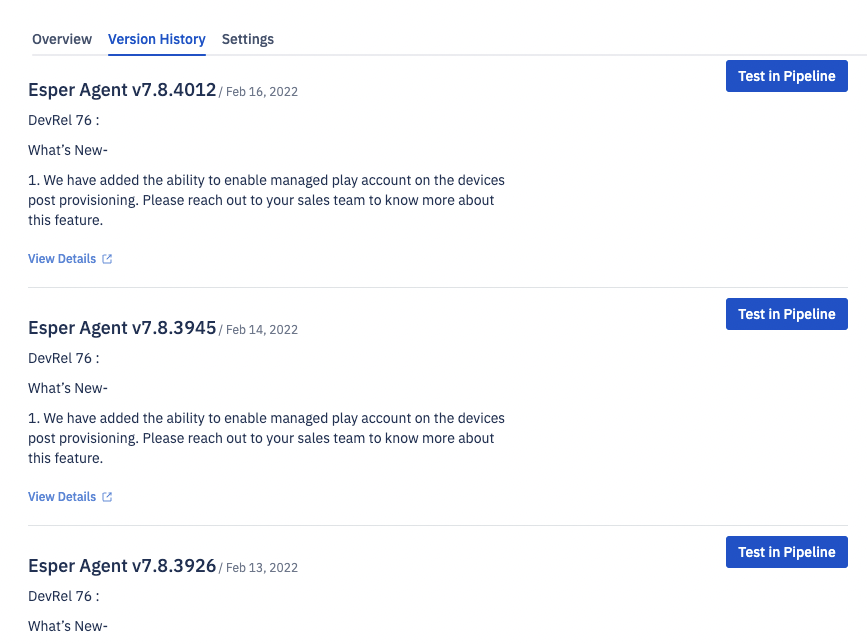

# What is Version History?

This page displays a list of the 10 most recent Esper Agent releases. Here you can view the release notes and deploy the update in a pipeline. Click **Test Pipeline** next to the desired version to build a pipeline and install the chosen Esper Agent on the devices.

  

:::tip
We recommend that you add more stages to stagger your release process.
:::
