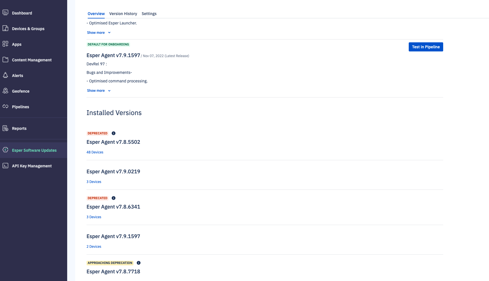
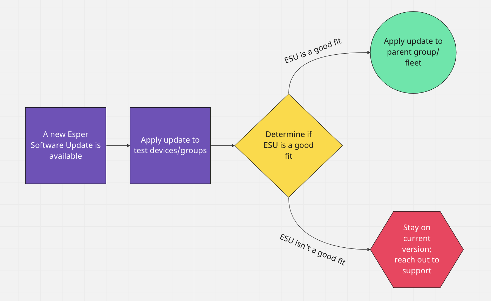
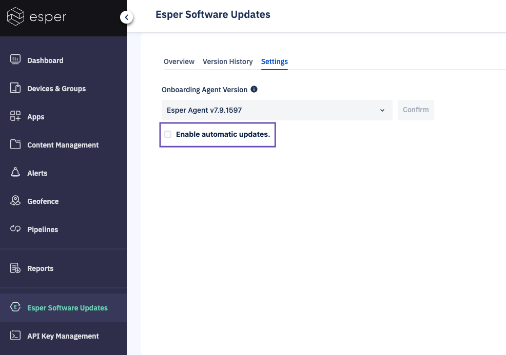
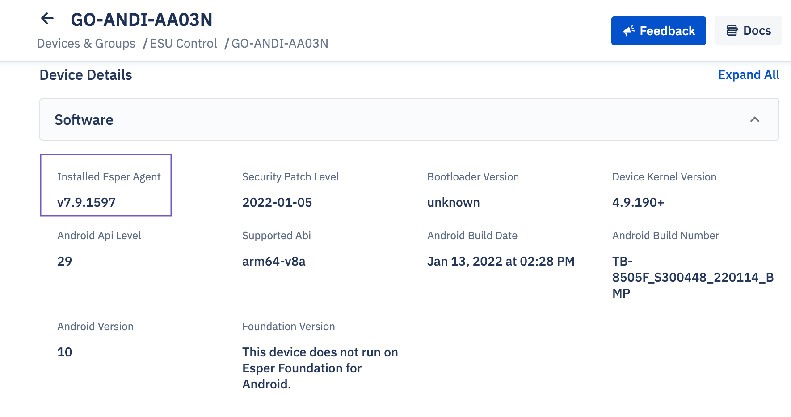
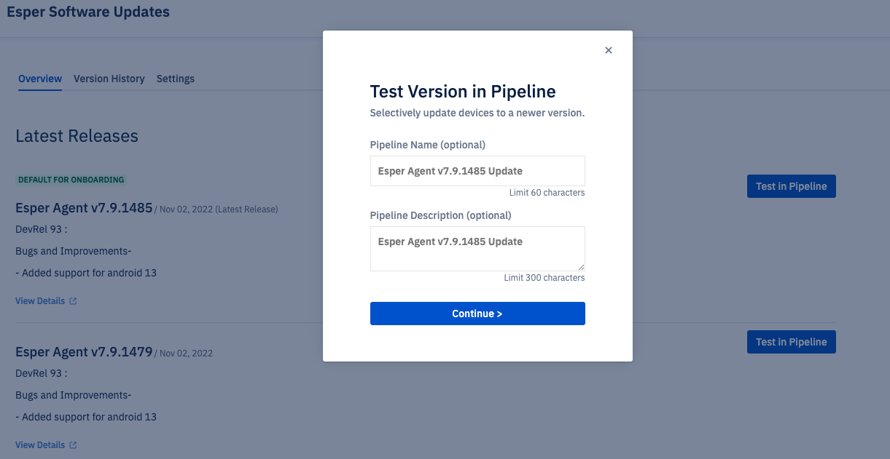
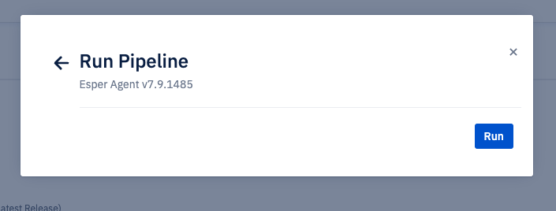
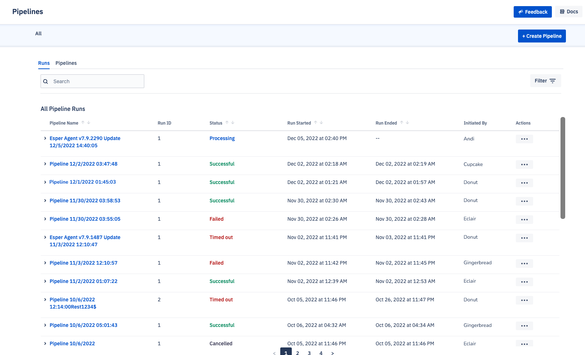

# Deploying Esper Software Updates

Here at Esper, we love to continuously improve our platform and services, but how can you be sure those updates are right for your fleet? With Esper Software Updates (ESU), you’re in control of which updates you push to your devices and when. 

**Requirements**: 
- Enterprise Admin 

**In this article:**
[[TOC]]

## What Are Esper Software Updates? 

Esper Software Updates allow administrators to roll out new versions of the Esper Agent to their devices, view information about changes introduced in each version, and control which devices receive which updates. Here’s some considerations to keep in mind before trying out ESU: 

- ESU allows you to skip automatic updates. You control when updates are pushed to your devices.
- Updates may be applied to your entire fleet, selected groups, or individual devices.
- You can now have a fleet of devices on different versions. 
- ESU allows you to stay on a version for an indefinite period. We recommend checking the software update status to keep your devices up-to-date when deprecations occur. You’ll be able to see the status of versions in **Esper Software Updates** > **Overview**. 

## Making the Most of Software Updates 

To make the most of your software updates, we recommend testing out the latest updates with a small number of devices *before* applying it to a larger group or fleet. 

**The ESU Process**

After testing the update on selected devices, determine whether or not to apply the update to the group or fleet. If the update isn’t a good fit for the test group, stay on the current version and reach out to [Esper Support](mailto:support@esper.io) to discuss any issues or bugs. 

Administrators may test updates on individual devices or groups. Optionally, they may also create Sub Groups. Creating a testing Sub Group has a few advantages: 
You’ll have a set of devices allocated for testing updates before they’re rolled out. 
Any changes made to the parent Group will cascade to the test Sub Group, no need to update separately. 

To make a test Group, identify the devices you’d like to test. These devices should be ones you have on hand that represent the devices in your fleet.  

For each Group, create a Sub Group. These Sub Groups will hold your test devices.

After creating the Group, add devices to that Group by provisioning them or by [moving the device](https://console-docs-v2.esper.io/devices-groups/readyonboard-action.html#onboarding-methods) to that Sub Group. 

## Enabling Update Settings 

In order to enable manual software updates, go to **Esper Software Updates** > **Settings*. Disable the checkbox “Enable automatic updates”. A modal will appear. Press **Confirm**. 

::: warning 
After disabling automatic updates, you will need to manually update devices. Failing to update devices regularly may result in devices no longer being supported through the Console. 
:::

## How to Check Which Esper Software Version Your Devices Are Running 

To see your device's Esper software version, locate the device in **Devices & Groups**. From the **Information** tab, navigate to the “Software Information” section. The device software version is listed under “Installed Esper Agent Version”. 

## Using Esper Software Updates

Esper Software Updates allows you to test the latest version in a small Group before deploying the update to all your devices. 

Once you’ve identified the devices you’d like to test, assign them to a new Group. Then, go to Esper Software Updates and press **Test in Pipeline**. 

You may optionally rename and describe the update. Then press **Continue**. 

On the next screen, select the devices or Groups to which you’d like to apply the update. 

You may also apply the updates in stages. 

After selecting the devices or Groups, click **Run**. The update will begin on the selected devices. 

Test whether or not an update will work for a single device, Group, or your whole fleet. 

## Seeing the Status of the Update in Pipelines 

Once you’ve run the update, check its [status in Pipelines](https://console-docs-v2.esper.io/pipeline/stage.html).

Once the update is applied, we recommend you test your devices to ensure the apps and user flows are working as expected. Once reviewed, roll out updates to the larger Group or fleet, or reach out to [Esper Support](mailto:support@esper.io) with any problems you encountered.

