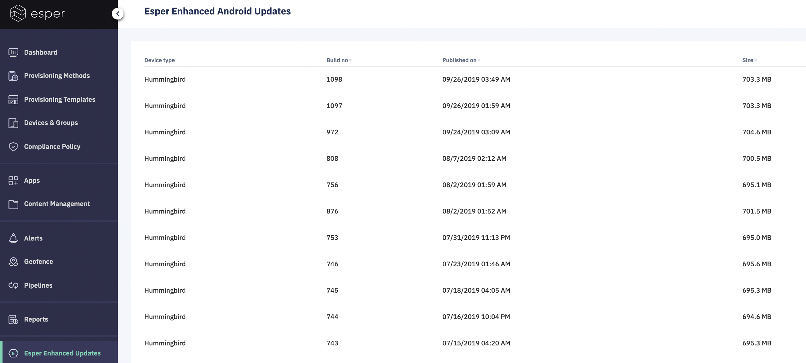

## What are Esper Software Updates?

  

Esper Foundation for Android devices are shipped with custom Android OS for improved security, faster deployments, and superior debugging. Esper's custom Android OS creates a better user experience on single-purpose devices.

  

  
  
:::tip
Only the latest thirty build versions of Esper Foundation for Android are listed for deployment.
:::