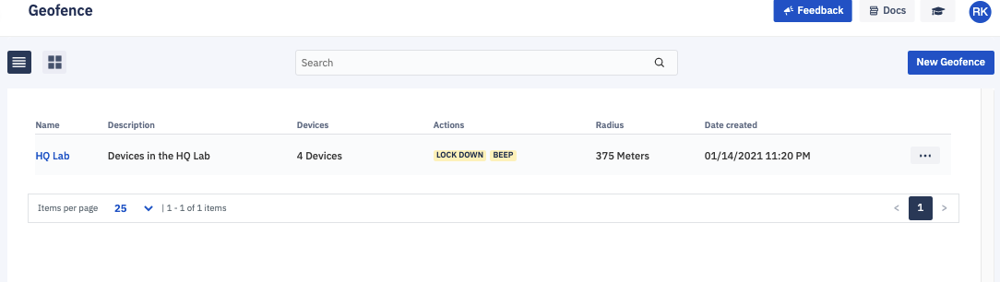
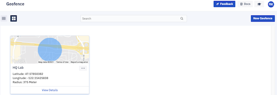
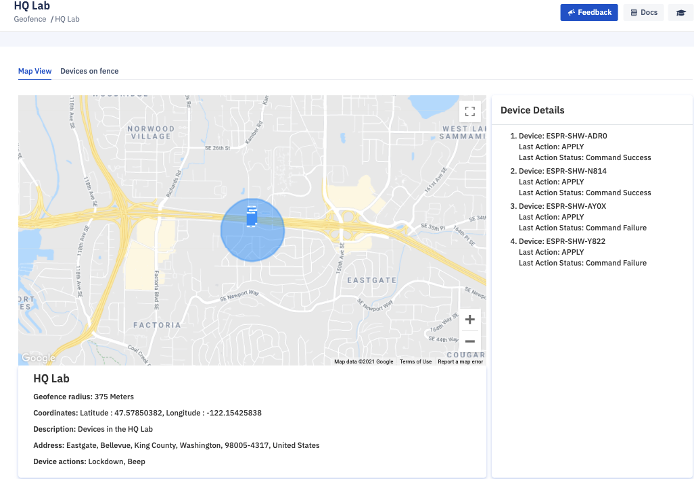
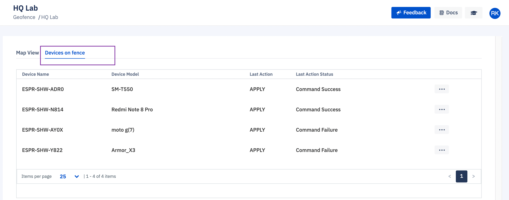

## What is Geofencing?

Geofencing lets you use a device’s location — generated by GPS — to trigger an alert when the device enters or leaves a defined area. Geofencing can offer protection against theft, loss, and unauthorized use.

In order for geofencing to work, the device must have internet connectivity and enabled location service. Geofencing is typically used for cellular-connected devices with high accuracy location services enabled, such as smartphones or tablets.

It has two view modes available: 

List view.

Grid view

To look at an existing geofence, click on the name of the device from the list. This will bring up an overview of the geofence.

  

To view the devices in relation to your geofence, navigate to the ‘Devices on Fence’ tab.

**Note**: Geofencing performance depends on the quality of GPS built into the devices. Also, your ability to track device location is dependent on Wi-Fi, Bluetooth, cellular connectivity, and internet connectivity. Geofencing is not supported for Android version 4.x.