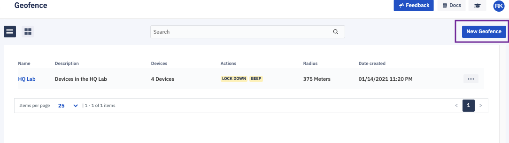
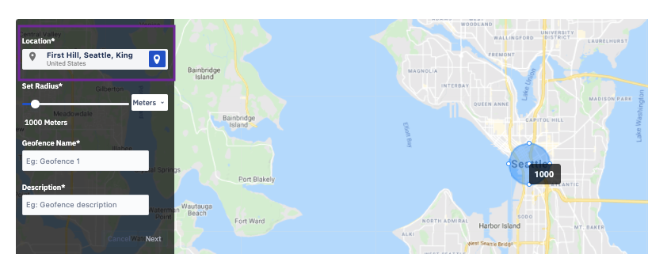
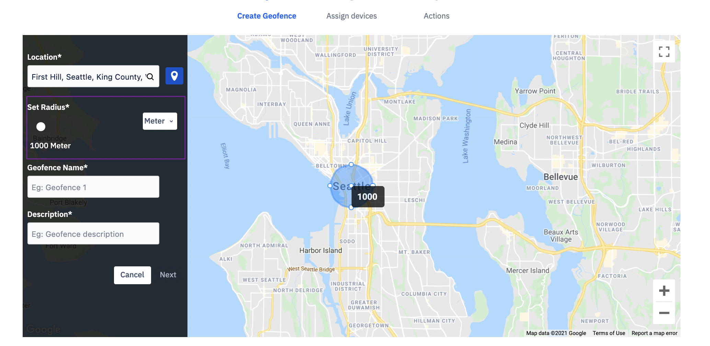
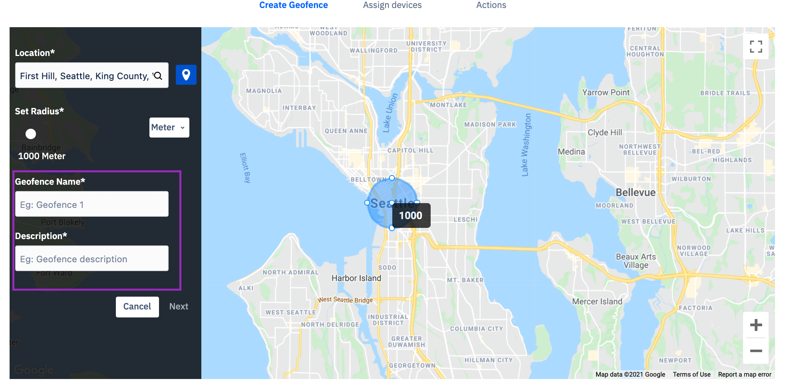
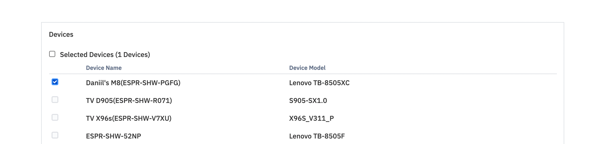
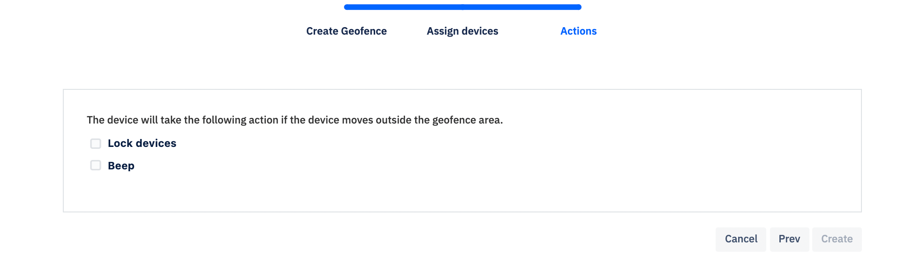
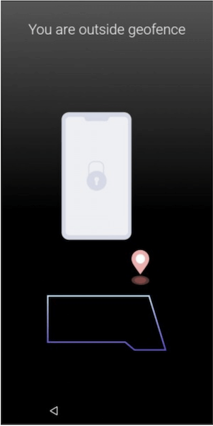

## How to Create a New Geofence?

  

Step 1: To set up a geofence, click **New Geofence**.

  
  

  

Step 2: Enter the address for the center of the circle in the Location field; the map will adjust to center the address.

  

Step 3: Use the slider to set the geofence radius. The geofence is a circle; its radius can be as small as 100 meters and as large as 10 kilometers. GPS can drift and jump, thus a geofence smaller than 100m can cause false positives.

  

  
  

Step 4: Enter a geofence name and description and click **Next**.

  
  

  

Step 5: Click the check box next to each device you’d like to assign to this geofence and click **Next**.

  

  
  

Step 6: To define the action when a device leaves the geofence, select Lock Devices, Beep, or both and click **Create**.

  

  

Step 7: If you choose to Lockdown the device, a lock screen will be displayed if the device is taken outside the geofence boundary. If you choose to beep, the device will keep beeping when it goes outside the geofence boundary. 

  

