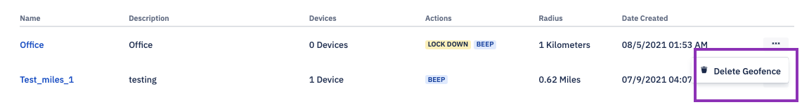
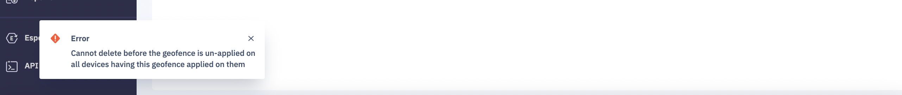

## How to Delete a Geofence?

  

To delete any geofence, go to more actions on the geofence homepage and Choose 'Delete Geofence.'

  

  

You cannot delete the geofence if it has linked devices. Before you delete geofence, make sure to remove the devices first from geofence, or you will receive the below error message.

  
  

