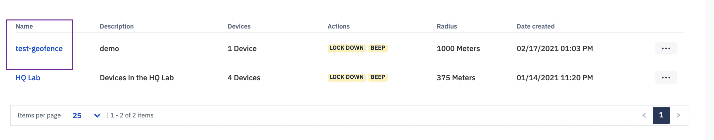
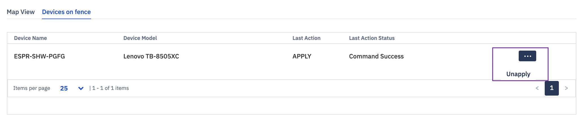

## How to Delete a Geofence from the Devices?

  

Step 1: Select any geofence from the geofence main page.

  

  

Step 2: Choose the 'Devices on Fence' tab.

  
  

  
  

Step 3: Click on the ellipsis against the device which you wish to remove. Then select the 'Unapply' option and your device will be removed from the geofence.

  

  

On success, you will see a toast success message.