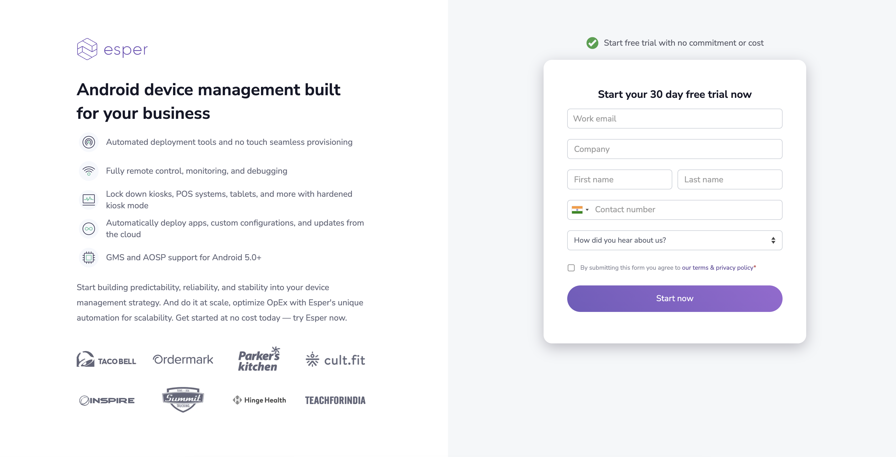

## How to Sign Up for a Trial Account?

To try out Esper, simply sign up for a developer trial account on the [Esper Website](https://esper.io/signup/). Once the account set up is complete, you generate your API key. You can test out all the features of our innovative platform—whether building out a kiosk, point of sale solution, or for an entirely new Dedicated Device category. It is the best platform designed for the Android application developer targeting Dedicated Devices. Check out the [Developer Hub](https://docs.esper.io/) and the [API Documentation](https://api.esper.io/).

### Set Up an Account

Your first step is to [sign up for a free trial account](https://esper.io/signup). During the signup process, you will be asked to enter a few quick details to set up your environment:

Once you click Start My Free Trial, you'll automatically log in to your new environment’s Console. You’ll also get an email with your temporary login credentials, along with the URL of your Console. (It will be something like foooo.esper.cloud, where “foooo” is the randomly generated five-letter name of your environment).

**Note**: Please change your password when you are redirected to your endpoint!

### Password Policy for Esper

All users are responsible for taking appropriate steps to ensure password security. We recommend that you follow best practices for password construction:

-   Avoid dictionary words or proper names.
    
-   Use at least eight (8) characters
    
-   Don’t use your User ID as a password.
   
-   Use both numeric and alphabetic characters in your password.
    
-   Avoid reusing your previous four passwords.
    

**Note**: Esper users are responsible for making sure their policy and practice reflect security and compliance. These practices include changing your password periodically (after a maximum of 90 days), especially if you hold administrative access to your Esper endpoint or you suspect your password may have been compromised.