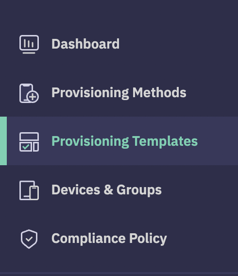

## How to Create a Provisioning Template?

Now that you have your very own endpoint, the next step is to create a Provisioning Template. A Provisioning Template enables you to define the initial profile for your devices. You can specify the configuration, applications to be loaded, and unique settings you wish to apply. Once you’ve created a template, you can use it to provision as many devices as you need.

To start creating a template, click on the Provisioning Templates link that appears in the left sidebar of your endpoint:

Please read  [steps to create a device template](../provisioning-template/createtemplate.md)  for more information on this process.