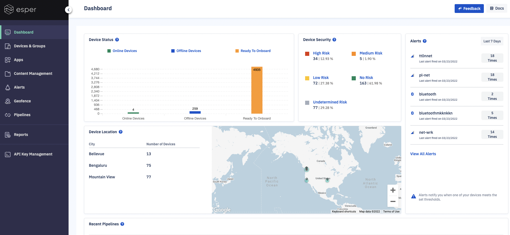

## How to Find Your Device on the Console?

One way to explore and interact with your devices is to use Esper’s Console. Once your device is ondoarded, you’ll start seeing it on your Console:

Here are some of the exciting things you can try out:

-   Define a [Blueprint](../devices-groups/create-blueprint.md) and apply it to a group.
-   Update an application you installed on your device to a newer version.
-   Initiate a remote-view (or remote-control if your device supports it) session (read more  [here](../devices-groups/remote-viewer.md)).
-   Experiment with a [Kiosk mode](../devices-groups/device-settings.md).
    

Once your devices are provisioned, you can explore Esper's Group management capabilities by creating new groups and moving devices. 