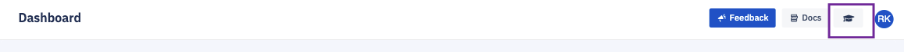

## What is a Learning Center?

The Learning Centre is designed to help a new user get comfortable with the Esper console and various features. It starts with a curated tour detailing various aspects that a new user gets to experience. You may choose to skip the tour at any point. The Learning Centre is available at the top right section of the console.

  

It includes:

-   Tutorial videos aimed at getting a better understanding of how to leverage Esper capabilities.
    
-   Frequently Asked Questions - Documentation covering popular questions and solutions.
    
-   Product Tour - a curated tour exploring widely used features of Esper.
    
-   What’s New Section covering updates and improvements to the Esper experience.