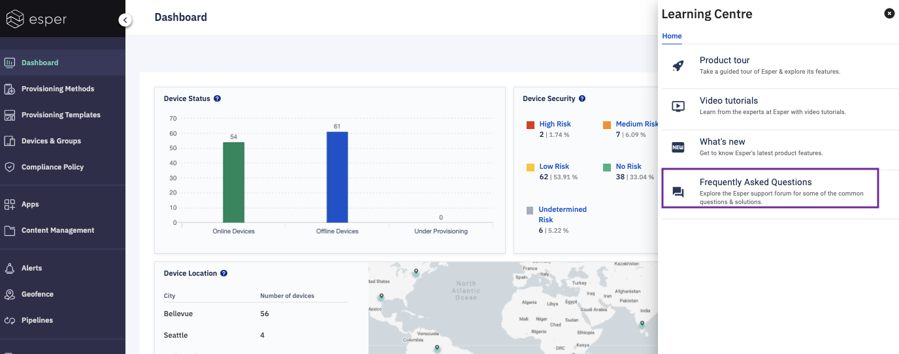
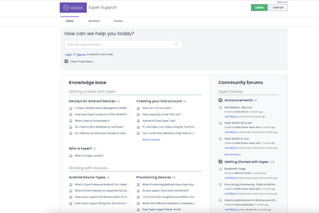

## How to Access FAQs From the Learning Centre?

Step 1: Go to the learning center and choose the ‘Frequently Asked Questions’ from the slide-out.

  

  

Step 2: You can check all the FAQs of this screen. Also, you can check the forums and discussions between the Esper community.

  

