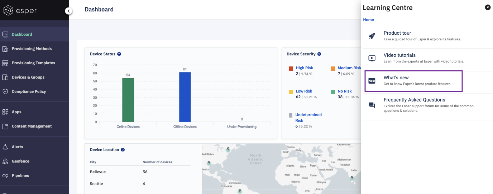
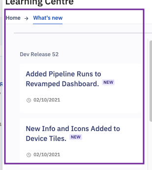

## How to Check the What’s New Section From the Learning Centre?

Step 1: Go to the Learning Center and click on **What’s New**.

  

  

Step 2: YYou will see a list of all changes released recently.

  

